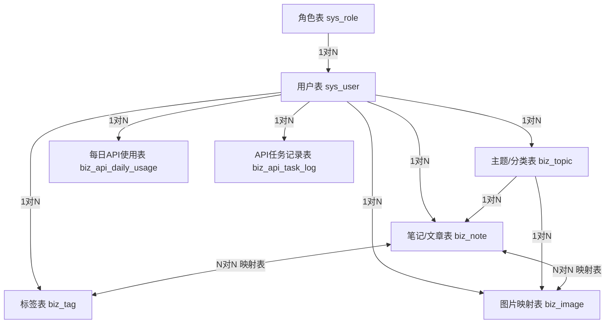

---

## 个人 SaaS 笔记系统数据库设计文档

### 表关系梳理

### 数据表汇总

| 序号 | 数据表名               | 中文名称             |
| ---- | ---------------------- | -------------------- |
| 1    | sys_role               | 系统角色与额度配置表 |
| 2    | sys_user               | 用户信息表           |
| 3    | biz_topic              | 笔记主题/分类表      |
| 4    | biz_tag                | 笔记标签表           |
| 5    | biz_note               | 笔记存储记录表       |
| 6    | biz_note_tag_mapping   | 笔记与标签映射表     |
| 7    | biz_image              | 图片资源映射表       |
| 8    | biz_note_image_mapping | 笔记与图片映射表     |
| 9    | biz_api_daily_usage    | 每日API调用统计表    |
| 10   | biz_api_task_log       | API异步任务明细表    |
| 11   | biz_meta_audit_record  | 元数据审核记录表     |
| 12   | biz_image_audit_record | 图片审核记录表       |
| 13   | biz_note_audit_record  | 笔记审核记录表       |

---

### 1. sys_role (系统角色与额度配置表)

用于存储系统角色信息，并统一管控各个角色的 API 调用上限与存储空间配额。

| 字段名            | 数据类型    | 说明                 | 备注                                           |
| ----------------- | ----------- | -------------------- | ---------------------------------------------- |
| id                | bigint      | 主键                 | 自增                                           |
| role_name         | varchar(50) | 角色名称             | 如：普通用户、VIP、管理员                      |
| role_code         | varchar(50) | 角色标识             | 唯一键 (`uk_role_code`)，如：USER, VIP         |
| daily_api_limit   | int         | 每日外部API调用上限  | 默认 5                                         |
| max_storage_bytes | bigint      | 默认最大存储空间     | 单位：字节，默认 104857600 (100MB)             |
| create_time       | datetime    | 创建时间             | 默认 CURRENT_TIMESTAMP                         |
| update_time       | datetime    | 更新时间             | 默认 CURRENT_TIMESTAMP ON UPDATE CURRENT_TIMESTAMP |

### 2. sys_user (用户信息表)

用于存储登录用户的基本信息及个体资源使用情况。

| 字段名             | 数据类型    | 说明                 | 备注                                           |
| ------------------ | ----------- | -------------------- | ---------------------------------------------- |
| id                 | bigint      | 主键                 | 自增                                           |
| username           | varchar(50) | 登录账号             | 唯一键 (`uk_username`)                         |
| password           | char(60)    | 加密密码             | 使用 BCrypt 加密存储                           |
| nickname           | varchar(50) | 昵称                 | 普通索引 (`idx_nickname` 与 status 联合)       |
| email              | varchar(100)| 邮箱地址             | 唯一键 (`idx_email`)，可为空                   |
| role_id            | bigint      | 关联的角色ID         | 默认 3 (普通用户)，普通索引 (`idx_role_id`)    |
| max_storage_bytes  | bigint      | 个性化最大存储空间   | 可为空 (NULL表示使用角色默认值)                |
| used_storage_bytes | bigint      | 当前已用存储空间 | 单位：字节，默认 0                             |
| status             | tinyint     | 状态                 | 2:未激活, 1:正常, 0:禁用。联合索引 (`idx_status_role`) |
| create_time        | datetime    | 注册时间             | 默认 CURRENT_TIMESTAMP                         |
| update_time        | datetime    | 更新时间             | 默认 CURRENT_TIMESTAMP ON UPDATE CURRENT_TIMESTAMP |

### 3. biz_topic (笔记主题/分类表)

用于存储用户创建的笔记分类体系，不同用户的数据相互隔离。

| 字段名      | 数据类型    | 说明                 | 备注                                           |
| ----------- | ----------- | -------------------- | ---------------------------------------------- |
| id          | bigint      | 主键                 | 自增                                           |
| user_id     | bigint      | 创建者ID             | 普通索引 (`idx_user_id`)                       |
| topic_name  | varchar(25) | 主题名称             | 联合唯一键 (`uk_topic_user`：topic_name+user_id) |
| sort_order  | int         | 排序字段             | 默认 0。联合索引 (`idx_user_sort_update`)      |
| is_pass     | tinyint     | 审核状态             | 0:待审核, 1:已通过, 2:已拒绝。默认 0           |
| create_time | datetime    | 创建时间             | 默认 CURRENT_TIMESTAMP                         |
| update_time | datetime    | 更新时间             | 默认 CURRENT_TIMESTAMP ON UPDATE CURRENT_TIMESTAMP |

### 4. biz_tag (笔记标签表)

用于存储用户创建的标签体系，可被多篇笔记复用。

| 字段名      | 数据类型    | 说明                 | 备注                                           |
| ----------- | ----------- | -------------------- | ---------------------------------------------- |
| id          | bigint      | 主键                 | 自增                                           |
| user_id     | bigint      | 创建者ID             | 普通索引 (`idx_user_id`)                       |
| tag_name    | varchar(20) | 标签名称             | 联合唯一键 (`uk_tag_user`：tag_name+user_id)   |
| is_pass     | tinyint     | 审核状态             | 0:待审核, 1:已通过, 2:已拒绝。默认 0           |
| create_time | datetime    | 创建时间             | 默认 CURRENT_TIMESTAMP                         |

### 5. biz_note (笔记存储记录表)

系统的核心业务表，记录每一篇笔记的元数据及文件存储路径。

| 字段名           | 数据类型     | 说明                 | 备注                                           |
| ---------------- | ------------ | -------------------- | ---------------------------------------------- |
| id               | bigint       | 主键                 | 自增                                           |
| user_id          | bigint       | 作者(用户ID)         | 普通索引 (`idx_user_id`)                       |
| topic_id         | bigint       | 所属主题ID           | 可为空 (未分类)。联合索引 (`idx_topic_deleted`) |
| title            | varchar(255) | 笔记标题             |                                                |
| html_file_path   | varchar(500) | HTML文件存储路径     |                                                |
| md_file_path     | varchar(500) | MD文件存储路径       | 可为空 (可选参数)                              |
| is_published     | tinyint      | 是否发布             | 1:公开, 0:私密。默认 0                         |
| storage_type     | tinyint      | 存储方式             | 1:阿里云OSS, 2:Cloudflare R2(预留)             |
| is_missing_photo | tinyint      | 是否缺少图片         | 0:正常, 1:缺少图片。默认 0                     |
| is_pass          | tinyint      | 审核状态             | 0:待审核, 1:已通过, 2:已拒绝。默认 0           |
| is_deleted       | tinyint      | 是否删除(软软删)     | 1:删除, 0:正常。默认 0                         |
| file_size        | bigint       | 文件大小合计         | HTML+MD总大小(字节)，默认 0                    |
| create_time      | datetime     | 创建时间             | 默认 CURRENT_TIMESTAMP                         |
| update_time      | datetime     | 更新时间             | 默认 CURRENT_TIMESTAMP ON UPDATE CURRENT_TIMESTAMP |

### 6. biz_note_tag_mapping (笔记与标签多对多关联表)

维护单篇笔记与多个标签之间的映射关系。

| 字段名      | 数据类型 | 说明           | 备注                                      |
| ----------- | -------- | -------------- | ----------------------------------------- |
| note_id     | bigint   | 笔记ID         | 联合主键 (`note_id`, `tag_id`)            |
| tag_id      | bigint   | 标签ID         | 联合主键。联合索引 (`idx_tag_deleted`)    |
| is_deleted  | tinyint  | 是否删除(软删) | 1:删除, 0:正常。默认 0                    |
| create_time | datetime | 关联时间       | 默认 CURRENT_TIMESTAMP                    |

### 7. biz_image (图片资源映射表)

集中管理系统内所有的图片资源，支持公共图片池设定。

| 字段名       | 数据类型      | 说明                 | 备注                                           |
| ------------ | ------------- | -------------------- | ---------------------------------------------- |
| id           | bigint        | 主键                 | 自增                                           |
| user_id      | bigint        | 上传者ID             |                                                |
| topic_id     | bigint        | 所属主题ID           | NULL代表未分类                                 |
| filename     | varchar(255)  | 文件名               | 联合索引 (`uk_user_topic_filename`)            |
| oss_url      | varchar(1000) | 云端完整访问URL      |                                                |
| storage_type | tinyint       | 存储方式             | 1:阿里云OSS, 2:Cloudflare R2(预留)             |
| file_size    | int           | 文件大小             | 单位：字节，可为空                             |
| is_public    | tinyint       | 是否公开             | 0:私有仅本人可引用, 1:公开可被其他用户搜索复用。联合索引 (`idx_public_filename`) |
| is_pass      | tinyint       | 审核状态             | 0:待审核, 1:已通过, 2:已拒绝。默认 0           |
| upload_time  | datetime      | 上传时间             | 默认 CURRENT_TIMESTAMP                         |

### 8. biz_note_image_mapping (笔记与图片映射表)

实现图片跨笔记、跨用户复用的核心表，关联笔记与具体的图片资产。

| 字段名            | 数据类型     | 说明                 | 备注                                           |
| ----------------- | ------------ | -------------------- | ---------------------------------------------- |
| id                | bigint       | 主键                 | 自增                                           |
| note_id           | bigint       | 关联的笔记ID         | 唯一键 (`uk_note_image` 与 image_id 联合)      |
| image_id          | bigint       | 关联的图片ID         |                                                |
| note_user_id      | bigint       | 笔记所属用户ID       | 冗余字段，避免JOIN。联合索引 (`idx_note_user_name`) |
| image_user_id     | bigint       | 图片所属用户ID       | 冗余字段，用于标识是否跨用户引用               |
| parsed_image_name | varchar(255) | MD中解析出的原始图名 |                                                |
| is_cross_user     | tinyint      | 是否跨用户引用       | 0:同一用户, 1:引用他人。默认 0                 |
| is_deleted        | tinyint      | 是否已删除(软删)     | 0:正常, 1:删除。相关普通联合索引防止回表       |
| create_time       | datetime     | 映射创建时间         | 默认 CURRENT_TIMESTAMP                         |
| update_time       | datetime     | 更新时间             | 默认 CURRENT_TIMESTAMP ON UPDATE CURRENT_TIMESTAMP |

### 9. biz_api_daily_usage (每日API调用次数统计表)

按日统计用户的 API 调用情况，便于执行限流逻辑。

| 字段名      | 数据类型 | 说明             | 备注                                           |
| ----------- | -------- | ---------------- | ---------------------------------------------- |
| id          | bigint   | 主键             | 自增                                           |
| user_id     | bigint   | 用户ID           | 联合唯一键 (`uk_user_date`：user_id+record_date) |
| record_date | date     | 记录日期         | 仅存年月日 (如 2024-05-20)                     |
| used_count  | int      | 当日已调用次数   | 默认 0                                         |
| create_time | datetime | 首次调用时间     | 默认 CURRENT_TIMESTAMP                         |
| update_time | datetime | 最后更新时间     | 默认 CURRENT_TIMESTAMP ON UPDATE CURRENT_TIMESTAMP |

### 10. biz_api_task_log (API异步任务明细表)

用于追踪耗时型 API（如大模型调用、Python脚本处理）的异步执行状态。

| 字段名      | 数据类型      | 说明             | 备注                                           |
| ----------- | ------------- | ---------------- | ---------------------------------------------- |
| id          | bigint        | 主键             | 自增                                           |
| user_id     | bigint        | 调用者ID         | 普通索引 (`idx_user_id`)                       |
| task_type   | varchar(50)   | 任务类型         | 如: generate_audio, analyze_text               |
| task_status | tinyint       | 任务状态         | 0:处理中, 1:成功, 2:失败。默认 0               |
| result_url  | varchar(1000) | 执行成功的文件链接 | 可为空                                         |
| error_msg   | text          | 失败时的错误信息 | 可为空                                         |
| create_time | datetime      | 任务提交时间     | 默认 CURRENT_TIMESTAMP                         |
| finish_time | datetime      | 任务完成时间     | 可为空                                         |

### 11. biz_meta_audit_record (元数据审核记录表)

用于审核主题和标签的申请记录，统一管理轻量级元数据的审核流程。

| 字段名            | 数据类型      | 说明                 | 备注                                           |
| ----------------- | ------------- | -------------------- | ---------------------------------------------- |
| id                | bigint        | 主键                 | 自增                                           |
| applicant_user_id | bigint        | 申请者用户ID         | 普通索引 (`idx_applicant_status`)              |
| apply_type        | tinyint       | 申请类型             | 1:主题, 2:标签。联合索引 (`idx_target`)       |
| target_id         | bigint        | 关联的主题ID或标签ID | 由 apply_type 决定                              |
| apply_reason      | varchar(500)  | 申请说明             | 可为空                                         |
| status            | tinyint       | 审核状态             | 0:待审核, 1:已通过, 2:已拒绝。联合索引 (`idx_status_type`) |
| reviewer_user_id  | bigint        | 审核员用户ID         | 可为空 (NULL=尚未审核)                         |
| reject_reason     | varchar(500)  | 拒绝原因             | 可为空 (status=2时填写)                        |
| create_time       | datetime      | 申请提交时间         | 默认 CURRENT_TIMESTAMP                         |
| review_time       | datetime      | 审核完成时间         | 可为空                                         |

### 12. biz_image_audit_record (图片审核记录表)

用于管理图片的公开/私有申请审核流程。

| 字段名            | 数据类型      | 说明                 | 备注                                           |
| ----------------- | ------------- | -------------------- | ---------------------------------------------- |
| id                | bigint        | 主键                 | 自增                                           |
| applicant_user_id | bigint        | 申请者用户ID         | 普通索引 (`idx_applicant_status`)              |
| image_id          | bigint        | 关联的图片ID         | 普通索引 (`idx_image_id`)                      |
| apply_reason      | varchar(500)  | 申请说明             | 可为空                                         |
| status            | tinyint       | 审核状态             | 0:待审核, 1:已通过, 2:已拒绝。普通索引 (`idx_status`) |
| reviewer_user_id  | bigint        | 审核员用户ID         | 可为空 (NULL=尚未审核)                         |
| reject_reason     | varchar(500)  | 拒绝原因             | 可为空 (status=2时填写)                        |
| create_time       | datetime      | 申请提交时间         | 默认 CURRENT_TIMESTAMP                         |
| review_time       | datetime      | 审核完成时间         | 可为空                                         |

### 13. biz_note_audit_record (笔记审核记录表)

用于管理笔记的发布申请审核流程。

| 字段名            | 数据类型      | 说明                 | 备注                                           |
| ----------------- | ------------- | -------------------- | ---------------------------------------------- |
| id                | bigint        | 主键                 | 自增                                           |
| applicant_user_id | bigint        | 申请者用户ID         | 普通索引 (`idx_applicant_status`)              |
| note_id           | bigint        | 关联的笔记ID         | 普通索引 (`idx_note_id`)                       |
| apply_reason      | varchar(500)  | 申请说明             | 可为空                                         |
| status            | tinyint       | 审核状态             | 0:待审核, 1:已通过, 2:已拒绝。普通索引 (`idx_status`) |
| reviewer_user_id  | bigint        | 审核员用户ID         | 可为空 (NULL=尚未审核)                         |
| reject_reason     | varchar(500)  | 拒绝原因             | 可为空 (status=2时填写)                        |
| create_time       | datetime      | 申请提交时间         | 默认 CURRENT_TIMESTAMP                         |
| review_time       | datetime      | 审核完成时间         | 可为空                                         |