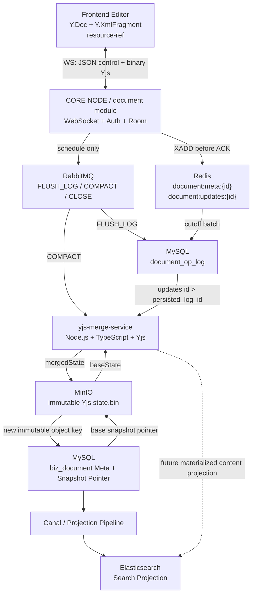

# 文档模块重构 v0.3｜Codex Implementation Plan

<aside>
🎯

**用途**：本页是文档模块 v0.3 的实现基线，目标是让 Codex 可以直接按阶段编码，而不再替架构做关键一致性决策。若本页与更早的文档模块草案冲突，以本页为当前实现基线；旧模块、旧表和旧接口暂不删除。

</aside>

<aside>
🤖

**Codex 启动入口**：[Codex Goal Prompt｜Document v0.3](Codex%20Goal%20Prompt%EF%BD%9CDocument%20v0%203%203c5d548d4cf5814f82b5e71991924d4b.md)。启动 Goal 时优先使用该 Prompt；其中已强制规定“小改动即 Git Commit”和“不确定事项局部 BLOCKED 等待用户确认”。

</aside>

# 1. Codex 执行总则

## 1.1 强约束

- **不得删除、重命名或大规模改写旧笔记/文档模块。** v0.3 采用并行演进，新建独立 `document` 模块，旧模块继续可运行。
- 新模块首先完成协同核心链路，不要求第一批代码同时完成 Relation、Agent、ES 全部能力。
- **每完成一个可独立验证的阶段必须执行一次 Git commit。** 不允许把整个重构堆成一个超大 commit。
- 每次 commit 前必须运行该阶段可以运行的单测/集成测试；测试失败不得以“后续再修”为理由提交。
- 遇到当前仓库无法确认的事实时，**停止该目标继续实现并向我报告 blocker**，不得自行创造关键约定。典型 blocker：现有鉴权接入方式、RabbitMQ 延迟队列基础设施、MinIO 封装、数据库迁移工具、前端编辑器 Binding、模块目录规范、统一错误码规范。
- 遇到 blocker 时，其他不依赖该 blocker 的任务可以继续；不得因为一个局部问题停止所有工作。
- 新增配置中，环境切换会变化的值**尽量不要通过操作系统环境变量注入**。优先沿用当前项目的 `jacolp.*` 配置风格，通过 `application-{profile}.yml`（如 `application-home.yml`、`application-prod.yml`）或现有配置中心直接覆盖。基础设施参数优先复用项目现有命名空间，例如 `jacolp.datasource.*`、`jacolp.redis.*`、`jacolp.rabbitmq.*`；新增 MinIO / Yjs Merge Service 等配置也沿用同级 `jacolp.*` 风格，不强制再包一层 `container`。
- Java **不得实现 Yjs Binary Protocol、不得解析 `Y.XmlFragment`、不得手写 CRDT merge**。

## 1.2 配置命名规则

优先遵循当前 middleware 项目已有的 `jacolp.*` 配置结构，并通过 Spring Profile 对不同环境直接覆盖。例如：

```yaml
spring:
  profiles:
    active: home
  datasource:
    url: jdbc:mysql://${jacolp.datasource.host}:${jacolp.datasource.port}/${jacolp.datasource.database}
    username: ${jacolp.datasource.username}
    password: ${jacolp.datasource.password}
  data:
    redis:
      host: ${jacolp.redis.host}
      port: ${jacolp.redis.port}
      password: ${jacolp.redis.password}
  rabbitmq:
    host: ${jacolp.rabbitmq.host}
    port: ${jacolp.rabbitmq.port}
    username: ${jacolp.rabbitmq.username}
    password: ${jacolp.rabbitmq.password}
```

环境差异值放在：

- 注意这部分内容不能添加到 git 中提交了

```
application-home.yml
application-dev.yml
application-prod.yml
```

等 profile 配置中，例如：

```yaml
jacolp:
  datasource:
    host: localhost
    port: 3306
    database: middleware
  redis:
    host: localhost
    port: 6379
  rabbitmq:
    host: localhost
    port: 5672
  minio:
    endpoint: http://localhost:9000
    access-key: minioadmin
    secret-key: change-me
    bucket:
      document: document
  elasticsearch:
    uris: http://localhost:9200
    username:
    password:
    index:
      document: document
  yjs-merge-service:
    base-url: http://localhost:3100
  document:
    close-delay-ms: 30000
```

原则：

- 不要为了 document 模块把已经存在的 Redis / RabbitMQ / Datasource 连接参数复制成另一套命名空间。
- 新基础设施使用与现有项目一致的一级 `jacolp.*` 风格，例如 `jacolp.minio.*`、`jacolp.elasticsearch.*`、`jacolp.yjs-merge-service.*`。
- Document 行为参数使用 `jacolp.document.*`，例如 close delay、batch size、snapshot threshold。
- 尽量不要使用 `${ENV_NAME:...}` 作为首选配置方式；只有项目已有部署机制明确要求时才复用。
- 密码、Secret 等敏感项不得硬编码；如何管理敏感值服从仓库现有约定。若无法确认，则作为 blocker 询问。

### 1.3 已确认：通用 MinIO / Elasticsearch 自动配置

MinIO 与 Elasticsearch 必须在 `middleware-framework` 中按现有 Aliyun OSS 的模式拆成
`autoconfigure + starter`：

```
middleware-minio-autoconfigure
middleware-minio-starter
middleware-elasticsearch-autoconfigure
middleware-elasticsearch-starter
```

自动配置只绑定连接参数并提供通用 Client：MinIO 提供 `MinioClient`，Elasticsearch 提供
官方 Java API `ElasticsearchClient`。它们不得携带 `document` 业务逻辑、Snapshot 路径或
SearchEntity mapping。`jacolp.minio.bucket.*` 和 `jacolp.elasticsearch.index.*` 使用通用
逻辑名映射；Document 模块只读取 `bucket.document` 与 `index.document`。因此
`jacolp.yjs-merge-service.*`、`jacolp.document.*` 必须与 `minio`、`elasticsearch` 同级，
绝不嵌套于 `jacolp.minio.*`。

### 1.4 已确认：第一版使用个人文档域

当前仓库尚未提供 Team 实体、成员关系、当前 Team 上下文或 Team 权限校验。因此 v0.3
第一版先使用个人文档域，并保留既定 `team_id` / `teamId` 字段以避免提前重做数据模型：

- `team_id` 的唯一值来源是服务端 `CurrentPrincipal.userId`；它在第一版等同于
  `owner_user_id`，不是客户端可指定的 Team ID。
- HTTP 创建、读取、修改、删除、WebSocket JOIN 与 Elasticsearch 查询都必须由服务端从
  当前登录用户派生这个 scope 值；客户端请求不得携带或覆盖 `teamId`。
- 第一版仅允许 `document.team_id == currentPrincipal.userId` 的用户访问文档。本文其余未
  特别说明的“Team / teamId / 当前 Team”在第一版均指此个人 scope。
- 未来接入正式 Team 模式时，必须先新增成员校验/当前 Team 解析能力，并单独确认个人文档
  向 Team 文档的迁移策略；不得在没有该能力时放宽访问过滤。

---

# 2. v0.3 已冻结的架构决策

1. CRDT 使用 **Yjs**。
2. 前端文档根结构使用 `Y.Doc + Y.XmlFragment('content')`。
3. `[[...]]` 在前端完成识别与补全，确认目标后转换为正式 `resource-ref` 结构化节点；Java 不重新解析 `[[xxx]]` 字符串。
4. 实时通信只使用 **WebSocket**，不再混用 SSE。
5. 控制消息使用 WebSocket Text Frame + JSON；Yjs State / Update / Awareness 使用 Binary Frame。
6. Java 收到客户端 Yjs Update 后，必须先成功写入 Redis Stream，再返回 `UPDATE_ACCEPTED` ACK 并广播；Redis 写入失败则不广播。
7. Redis 不保存完整正文，只保存 Room Meta 与尚未转存 MySQL 的 pending Yjs Updates。
8. Redis pending Update 会先可靠转存 MySQL `document_op_log`；该阶段叫 **FLUSH_LOG**。
9. Snapshot 生成与 FLUSH_LOG 分离；Snapshot 合并阶段叫 **COMPACT**。
10. MinIO 保存由 `Y.encodeStateAsUpdate(doc)` 生成的完整 Yjs State Binary，使用 immutable object，不覆盖旧对象。
11. MySQL 保存当前有效 MinIO Object Key，并通过 CAS 切换 Snapshot 指针。
12. Yjs merge 由独立、无状态的 TypeScript `yjs-merge-service` 完成。
13. RabbitMQ 只承担异步调度，不携带正文、Snapshot 或 Update List，不作为文档事实源。
14. CLOSED 的定义：final FLUSH_LOG + final COMPACT 成功，且当前文档没有未持久化 pending Update 后，才允许清理 Room/Redis runtime state。
15. Awareness / Cursor / 在线状态只属于实时态，**不持久化**。

## 2.1 v0.3 对旧设计的一项显式修订：Snapshot 水位线

旧草案使用 Redis Stream ID 作为 `persistedOpId`。v0.3 修改为：

- Redis Stream ID：仅用于 `Redis -> MySQL` cutoff、删除 pending entry、传输链路幂等。
- MySQL `document_op_log.id`：作为跨 Room 生命周期的长期持久化水位线。
- `biz_document.persisted_log_id`：表示当前 MinIO Snapshot 已经包含到哪个 `document_op_log.id`。

原因：Redis Stream 在 Room CLOSED 后可能被清理并重新创建，Stream ID 不适合作为跨生命周期永久版本号；MySQL 自增 log id 更适合长期 Snapshot watermark。

---

# 3. 第一版系统规模假设

<aside>
📏

这些数字是 v0.3 的工程边界，不代表长期产品上限。第一版优先验证正确性、恢复能力和可维护性，不为了百万并发提前引入复杂分布式协议。

</aside>

- 单 Region 部署。
- CORE NODE Java 服务第一版按 **1~2 个实例**设计；不能依赖 JVM 本地锁作为最终正确性保障。
- 同时在线 WebSocket Session：目标约 **500**，设计不得在每个 Session 中保留完整文档副本。
- 同时活跃 Room：目标约 **100**。
- 单文档常规同时编辑人数：**1~20**；第一版硬限制建议 **50**。
- 单文档 `resource-ref` 第一版仍限制 **<= 50**。
- 单次 Yjs Update 建议硬限制 **256 KiB**；超限拒绝并返回协议错误。
- 单文档 Snapshot 常规目标 **<= 2 MiB**；第一版允许上限 **10 MiB**，超过后记录告警并阻止继续无限膨胀的异常请求。
- 单次 FLUSH_LOG 建议最多读取 **500 条 Update 或约 2 MiB binary**，达到任一阈值即切批。
- 单次 COMPACT 建议最多合并一个明确 `cutoffLogId` 之前的日志；执行期间新进入的 op_log 不属于本轮 Snapshot。
- 第一版不实现跨 Region 实时协同、不实现离线客户端无限期本地编辑后的复杂差量同步优化。
- reconnect 第一版优先重新执行 bootstrap，不实现 Java 侧 Yjs State Vector 差量计算。

---

# 4. 总体架构

## 4.1 v0.3 可编码架构图



## 4.2 现有架构图的保留原则

现有《文档模块架构设计》继续作为宏观组件与生命周期参考，不删除。v0.3 的变化主要是把原图中的模糊 `CacheDocs.Content / Fixed Async / Coverage Update / WebSocket-SSE` 进一步冻结成：

```
WebSocket only
Redis pending updates
    -> FLUSH_LOG
MySQL document_op_log
    -> COMPACT
Yjs Merge Service
    -> immutable MinIO state.bin
MySQL CAS pointer
```

因此 Codex 不应重新讨论是否采用 CRDT、是否采用 Yjs、是否把全文放 Redis、是否让前端充当 Merge Service。

---

# 5. Source of Truth 与恢复模型

文档“最新可恢复状态”由三层组成：

```
MinIO Snapshot
+ MySQL document_op_log 中 id > persisted_log_id 的 Update
+ Redis Stream 中尚未完成 FLUSH_LOG 的 pending Update
```

Room 内存只负责 Session、广播和 runtime 状态，**绝不能成为唯一正文来源**。

## 5.1 各层职责

### MySQL `biz_document`

保存 Document Meta、当前 Snapshot Object Key、当前 `persisted_log_id`、删除状态、最后修改信息。

### MinIO

保存完整 Yjs State Snapshot Binary。Object immutable；MySQL 指针决定哪个对象当前有效。

### MySQL `document_op_log`

保存已经可靠转存 DB、但可能尚未进入 Snapshot 的 Yjs Update。它是 durable incremental log。

### Redis Stream

保存服务端已经 ACCEPTED、但尚未完成 MySQL FLUSH_LOG 的 pending Update。

### Elasticsearch

只作为搜索投影；任何指定文档正文读取都不得依赖 ES 正确性或实时性。

## 5.2 CLOSED 的严格定义

只有满足以下条件才允许从 PRE_CLOSE 进入 CLOSED：

```
sessionCount == 0
AND closeToken 与消息一致
AND final FLUSH_LOG 成功
AND final COMPACT 成功
AND Redis pending updates 已清空/已可靠转存
AND 不存在 id > persisted_log_id 的未合并 document_op_log
```

CLOSED 后，正文必须能够只依赖：

```
MySQL biz_document
+
MinIO current state.bin
```

恢复。

---

# 6. Java 新 `document` 模块设计

Codex 应先检查当前仓库的 Maven/Gradle 模块结构、package 命名、Controller/Service/Repository 规范，然后在不改旧模块的前提下创建新的 `document` 模块或等价独立 package。若仓库结构无法判断“模块”应是 Maven module 还是业务 package，先阻塞询问。

当前仓库已确认业务模块使用 `api + biz` 双 Maven 子模块，因此新模块固定为
`middleware-module-document/middleware-module-document-api` 与
`middleware-module-document/middleware-module-document-biz`。Document Biz 依赖 MinIO /
Elasticsearch Starter，但只使用其通用 Client；业务侧的 `MinioDocumentStorage` 负责
Document 专属 immutable Snapshot object key，不属于框架自动配置。

建议逻辑分层：

```
document
├─ controller
│  └─ DocumentController
├─ websocket
│  ├─ DocumentWebSocketHandler
│  ├─ DocumentRoomManager
│  ├─ DocumentRoom
│  ├─ DocumentSessionContext
│  └─ DocumentWsCodec
├─ service
│  ├─ DocumentService
│  ├─ DocumentBootstrapService
│  ├─ DocumentUpdateIngestService
│  ├─ DocumentFlushLogService
│  ├─ DocumentCompactService
│  └─ DocumentCloseService
├─ persistence
│  ├─ DocumentRepository
│  └─ DocumentOpLogRepository
├─ cache
│  └─ DocumentRedisRepository
├─ mq
│  ├─ DocumentSchedulePublisher
│  └─ DocumentScheduleConsumer
├─ client
│  ├─ YjsMergeClient
│  └─ MinioDocumentStorage
├─ model
│  ├─ entity
│  ├─ dto
│  ├─ enums
│  └─ message
└─ config
   └─ DocumentProperties
```

Java 边界：

```
Java 负责：
- HTTP CRUD / Meta
- WebSocket 鉴权
- Room 生命周期
- binary update 透传
- Redis Stream
- RabbitMQ 调度
- document_op_log
- MySQL Meta
- MinIO pointer
- 调用 Yjs Merge Service

Java 不负责：
- 解析 Y.XmlFragment
- 解析 resource-ref 的正文语义
- CRDT 冲突算法
- Yjs update merge
- Yjs binary protocol 内部编码
```

---

# 7. 核心数据结构

## 7.1 `biz_document`

第一版核心字段建议：

```sql
CREATE TABLE biz_document (
    id BIGINT PRIMARY KEY,
    team_id BIGINT NOT NULL, -- v0.3 第一版固定等于 owner_user_id
    title VARCHAR(255) NOT NULL,
    content_object_key VARCHAR(512) NULL,
    persisted_log_id BIGINT NOT NULL DEFAULT 0,
    last_modify_time BIGINT NOT NULL,
    last_modify_user_id BIGINT NULL,
    deleted TINYINT NOT NULL DEFAULT 0,
    version BIGINT NOT NULL DEFAULT 0
);
```

说明：

- `content_object_key = NULL` 表示新文档尚未产生 Snapshot，客户端以空 `Y.Doc` 初始化。
- `persisted_log_id` 表示当前 Snapshot 已经包含的最大 `document_op_log.id`。
- `version` 可用于 Meta CAS/未来扩展；Snapshot CAS 第一版至少必须比较旧 `persisted_log_id`。
- 当前仓库没有 Team 域，第一版 `team_id` 固定由服务端当前用户 ID 写入，作为个人文档域的
  owner scope；不得信任客户端传入的 `teamId`。正式 Team 模式上线前需另行确认迁移策略。
- DDL 字段命名最终应服从仓库现有数据库规范；如有统一 `create_time/update_time/del_flag` 基类字段，不得另造风格，需复用。

## 7.2 `document_op_log`

```sql
CREATE TABLE document_op_log (
    id BIGINT PRIMARY KEY AUTO_INCREMENT,
    document_id BIGINT NOT NULL,
    redis_op_id VARCHAR(64) NOT NULL,
    client_update_id CHAR(36) NULL,
    update_data LONGBLOB NOT NULL,
    operator_id BIGINT NULL,
    operator_type VARCHAR(16) NOT NULL,
    created_at BIGINT NOT NULL,
    UNIQUE KEY uk_document_redis_op (document_id, redis_op_id),
    KEY idx_document_log (document_id, id)
);
```

可选增强：如前端稳定生成 `clientUpdateId`，可增加 `UNIQUE(document_id, client_update_id)`，用于 ACK 丢失后的客户端重发去重。即使未增加该唯一键，Yjs 对重复 Update 仍可安全收敛，但会产生冗余日志。

## 7.3 Redis

### Room Meta

```
KEY: document:meta:{documentId}
TYPE: Hash

FIELDS:
documentId
teamId
isClose
closeToken
lastModifyTime
lastModifyUserId
```

可按实际调度实现增加 runtime 字段，但不得把完整正文写入该 Hash。

### Pending Updates

```
KEY: document:updates:{documentId}
TYPE: Redis Stream

ENTRY:
update           binary
clientUpdateId   uuid
operatorId
operatorType
createdAt
```

Redis Stream ID 仅用于本阶段 cutoff / XDEL / Redis→DB 幂等，不再作为长期 Snapshot version。

## 7.4 MinIO Object

```
document/{documentId}/state/{snapshotId}.bin
```

规则：

- `snapshotId` 使用 UUID/ULID；若项目已有 ID 生成器则复用。
- 永远 PUT 新对象，不覆盖当前对象。
- MySQL CAS 成功后新对象才成为 current state。
- MinIO PUT 成功但 MySQL CAS 失败时，新对象为 orphan，允许后续 GC。
- 第一版 GC 可先记录 TODO/Metric，不要求阻塞主链实现完整清理器。

---

# 8. HTTP 接口清单

接口路径最终需要遵循项目已有 Controller 前缀规范；如果项目已经统一 `/api` 或网关前缀，则复用。下面使用逻辑路径表达，不要求 Codex强行改变现有全局路由。

## 8.1 创建文档

```
POST /document
```

Request：

```json
{
  "teamId": 1,
  "title": "Untitled"
}
```

行为：

1. 使用现有鉴权体系确认当前用户已登录，并将 `team_id` 固定写为当前用户 ID；客户端不传
   `teamId`。
2. 创建 `biz_document` Meta。
3. 不强制立即创建空 MinIO state.bin；`content_object_key` 可为空。
4. 不触碰旧 note/document 表。

## 8.2 获取文档 Meta

```
GET /document/{documentId}/meta
```

返回 title、teamId、lastModifyTime、lastModifyUser 等业务字段；**不直接返回 MinIO Object Key** 给普通客户端。

## 8.3 修改文档 Meta

```
PATCH /document/{documentId}/meta
```

第一版只允许明确字段，例如 title；不得把 CRDT Content 混入 Meta PATCH。

## 8.4 删除文档

```
DELETE /document/{documentId}
```

第一版采用逻辑删除，具体字段必须复用项目既有删除规范。若 Room 正在活跃，删除语义、强制断开还是禁止删除目前没有从现有仓库确认，**Codex 在实现这一分支前必须阻塞询问**，不得自行选择。

## 8.5 搜索接口（保留，不作为第一批协同核心阻塞项）

现有设计中的全文搜索属于 ES Projection：

```
GET /document/search?content=...
```

具体 SearchEntity、Meta/Content 投影合并、projection lag SLA 尚未在 v0.3 冻结，Codex 第一批不要自行实现搜索索引结构。

---

# 9. WebSocket 协议

## 9.1 Endpoint

逻辑 Endpoint：

```
/ws/document
```

鉴权优先复用当前项目 WebSocket/Gateway/JWT 体系。不得再新增一套独立 token 协议。如果仓库没有可复用 WS 鉴权样例，先阻塞询问。

## 9.2 Text Frame：控制协议

所有控制消息至少携带：

```json
{
  "protocolVersion": 1,
  "type": "JOIN_DOCUMENT",
  "requestId": "uuid"
}
```

第一版类型：

```
JOIN_DOCUMENT
JOIN_ACCEPTED
SYNC_COMPLETE
LEAVE_DOCUMENT
UPDATE_ACCEPTED
AWARENESS_META       optional
ERROR
PING / PONG           only if current WS framework needs app-level heartbeat
```

### JOIN_DOCUMENT

```json
{
  "protocolVersion": 1,
  "type": "JOIN_DOCUMENT",
  "requestId": "uuid",
  "documentId": 123
}
```

### JOIN_ACCEPTED

```json
{
  "protocolVersion": 1,
  "type": "JOIN_ACCEPTED",
  "requestId": "uuid",
  "documentId": 123
}
```

### UPDATE_ACCEPTED

只有 Redis `XADD` 成功后才能发送：

```json
{
  "protocolVersion": 1,
  "type": "UPDATE_ACCEPTED",
  "documentId": 123,
  "clientUpdateId": "uuid",
  "redisOpId": "1755322000010-2"
}
```

这里的 ACK 表示：

```
服务端已经 ACCEPTED，并写入 Redis pending log。
```

它**不等价于已经生成 MinIO Snapshot**，也不承诺已经进入 MySQL `document_op_log`。

## 9.3 Binary Frame

Java 只解析自定义外层 Header，不解析 Yjs payload。

第一版 Header：

```
byte 0      protocolVersion = 1
byte 1      frameType
byte 2..17  eventId / clientUpdateId UUID 16 bytes
byte 18..N  payload (raw Yjs binary)
```

Frame Type：

```
0x01 CLIENT_UPDATE       Client -> Server
0x02 CRDT_UPDATE         Server -> Client live broadcast
0x03 SNAPSHOT_STATE      Server -> Client bootstrap baseState
0x04 BOOTSTRAP_UPDATE    Server -> Client bootstrap incremental update
0x05 AWARENESS           bidirectional, not persisted
```

对于 `SNAPSHOT_STATE / BOOTSTRAP_UPDATE`，UUID 字段允许使用全 0 UUID 或服务端生成 eventId；具体编码保持简单，不把业务 JSON 混入 binary payload。

## 9.4 Client Update 的服务端顺序

必须按照：

```
validate session + joined document
↓
check payload size
↓
Redis XADD
↓
update document:meta lastModifyTime
↓
UPDATE_ACCEPTED ACK
↓
broadcast to Room other sessions
↓
schedule FLUSH_LOG
```

若 Redis XADD 失败：

```
ERROR
no ACK
no broadcast
```

这样不会出现“其他用户已经看到，但服务端没有任何可恢复副本”的状态。

---

# 10. JOIN / Bootstrap / Reconnect

第一版不要求 Java 计算 Yjs State Vector。JOIN 与 reconnect 使用同一套 bootstrap。

## 10.1 Bootstrap 数据组成

```
baseState = 当前 MinIO Snapshot（可为空）
updatesA  = MySQL document_op_log WHERE id > persisted_log_id
updatesB  = Redis pending Stream 当前可见 entries
```

Java 不 merge；依次把这些 binary 发送给前端，前端全部调用：

```tsx
Y.applyUpdate(ydoc, update)
```

重复或乱序 Update 由 Yjs 自身处理。

## 10.2 避免 JOIN 与实时修改之间出现缺口

JOIN 通过权限检查后：

1. 先把 Session 注册到 Room，状态记为 `SYNCING`。
2. 客户端处于只读/编辑锁定状态。
3. 服务端开始读取 Snapshot + MySQL op_log + Redis pending。
4. 同期新到的 live update 仍可以发送到这个 SYNCING session。
5. bootstrap 与 live update 即使交错、重复，前端都使用 `Y.applyUpdate()`。
6. 所有 bootstrap frame 发送完后发送 `SYNC_COMPLETE`。
7. 客户端解除编辑锁，Session 状态进入 `ACTIVE`。

这利用 Yjs 的幂等/可交换 update 语义避免“先取 Snapshot 后加入 Room”产生的同步窗口。

---

# 11. Room 生命周期

状态：

```
OPEN / ACTIVE
↓ last session leaves
PRE_CLOSE
↓ 30s delay
CLOSING
↓ final flush + compact
CLOSED
```

最后一个 Session 离开：

```
isClose = true
closeToken = UUID-A
publish delayed CLOSE(UUID-A)
```

如果 30s 内有人回来：

```
isClose = false
closeToken = UUID-B
```

CLOSE 消费时必须再次检查：

```
isClose == true
AND message.closeToken == redis.closeToken
AND roomSessionCount(documentId) == 0
```

然后执行：

```
final FLUSH_LOG
↓
final COMPACT
↓
再次检查 sessionCount / closeToken
↓
清理 Room runtime / Redis runtime keys
↓
CLOSED
```

如果 final flush/compact 失败，不得把 Room 标记为 CLOSED；进入 retry/DLQ/Recovery 路径。

---

# 12. FLUSH_LOG：Redis -> MySQL durable log

## 12.1 触发策略

第一版建议：

- dirty Room 首次 Update 后约 **2s** 调度一次 FLUSH_LOG。
- 连续编辑期间允许每约 2s 形成一批，而不是每次敲键都写 MySQL。
- CLOSE 强制 final FLUSH_LOG。
- 如 MQ publish 失败或消息丢失，需要 Recovery Scanner 对活跃 `document:meta:*` 做低频检查，发现 pending Stream 长时间未转存时重新调度；第一版活跃 Room 规模约 100，使用 Redis SCAN 可接受。

RabbitMQ 的延迟实现必须复用仓库已有约定。若当前项目没有已确认的 delayed exchange / TTL+DLX 实现，不要私自引入 RabbitMQ 插件，先阻塞询问。

## 12.2 消费流程

```
read current Redis Stream batch
↓
record cutoffRedisOpId + processed entry ids
↓
batch INSERT document_op_log
↓
MySQL COMMIT
↓
XDEL processed Redis Stream entry ids
```

要求：

- `UNIQUE(document_id, redis_op_id)`。
- DB commit 成功、Redis XDEL 前进程崩溃：下次重复 INSERT 必须因唯一键安全幂等，然后继续删除 Redis entry。
- 不追求 Exactly-Once；目标为 **At-Least-Once + Idempotency**。
- Room 活跃期间不要因为本轮 Stream 为空就随意 `DEL document:updates:{id}`。

---

# 13. COMPACT：op_log -> immutable Snapshot

## 13.1 触发策略

第一版建议满足任一条件即可调度：

- 距离上次成功 Snapshot 约 **20s** 且存在未合并 op_log；
- 未合并日志 >= **200 条**；
- 未合并 binary 总量约 >= **1 MiB**；
- Room idle；
- CLOSE final compact。

这些值必须做成 `jacolp.function.document.*` 配置，不要散落 magic number。

## 13.2 Merge 流程

开始时读取：

```
basePersistedLogId = biz_document.persisted_log_id
baseObjectKey      = biz_document.content_object_key
```

然后查询：

```sql
SELECT *
FROM document_op_log
WHERE document_id = ?
  AND id > ?
ORDER BY id ASC;
```

本轮记录：

```
cutoffLogId = 当前读取到的最大 document_op_log.id
```

调用 Merge Service：

```
baseState + updates(id <= cutoffLogId)
↓
mergedState
```

PUT：

```
document/{id}/state/{newSnapshotId}.bin
```

然后 MySQL CAS：

```sql
UPDATE biz_document
SET content_object_key = ?,
    persisted_log_id = ?,
    version = version + 1
WHERE id = ?
  AND persisted_log_id = ?;
```

CAS 影响 1 行：成功。

CAS 影响 0 行：说明其他 Worker 已推进 Snapshot；本 Worker 不覆盖新状态，新 MinIO Object 作为 orphan 等待 GC。

成功后：

```sql
DELETE FROM document_op_log
WHERE document_id = ?
  AND id <= ?;
```

删除失败不会破坏正确性，因为后续查询使用 `id > persisted_log_id`；只会产生可清理冗余。

## 13.3 并发策略

最终正确性依靠：

```
Immutable MinIO + MySQL CAS
```

可选使用 Redis distributed lock 减少重复 Merge，但 **Redis Lock 只能优化重复工作，不能替代 CAS 正确性**。

---

# 14. Yjs Merge Service

独立无状态 TypeScript 服务：

```
core-node-java
    │ internal HTTP
    ▼
yjs-merge-service
Node.js + TypeScript + Yjs
```

## 14.1 API

```
POST /internal/yjs/merge
```

Request 第一版允许 Base64 JSON：

```json
{
  "baseState": "base64-or-null",
  "updates": ["base64", "base64"]
}
```

核心实现：

```tsx
const doc = new Y.Doc()

if (baseState) {
  Y.applyUpdate(doc, decode(baseState))
}

for (const update of updates) {
  Y.applyUpdate(doc, decode(update))
}

const mergedState = Y.encodeStateAsUpdate(doc)
```

Response：

```json
{
  "mergedState": "base64"
}
```

第一版 Merge Service：

- 不访问 MySQL/Redis/MinIO。
- 不自己保存状态。
- 不承担 Room。
- 不成为用户侧前端依赖。
- 只负责 Yjs 官方 API apply/encode。

如果当前仓库没有 Node/TypeScript 子项目的部署规范，Codex 完成 Java client/interface 后应阻塞询问 Merge Service 应放同仓还是独立仓库，不得自行决定生产部署结构。

---

# 15. `resource-ref` 第一版 Schema

前端正式节点建议至少包含：

```tsx
interface ResourceRefAttrs {
  resourceId?: string
  resourceType: string
  displayText: string
  alias?: string
}
```

第一阶段支持节点：

```
doc
paragraph
heading
text
bullet-list
ordered-list
list-item
code-block
blockquote
image
resource-ref
```

职责：

```
Frontend:
- [[ ]] 输入识别
- 补全搜索 UI
- resource-ref 节点生成
- Yjs transaction
- Yjs update apply/generate

Backend:
- 不重新解析 [[xxx]]
- 不通过字符串 offset 维护双链
```

Relation 第一版语义现已在本页 **#29 Relation Graph：补全 / Bind / DeleteBind / Rebind 第一版冻结方案** 中冻结：CRDT `resource-ref` 为正文事实源，Relation Table 为 Projection；bind/deleteBind/rebind、UNRESOLVED/BROKEN/DELETED 以及 COMPACT Reconcile 均按 #29 执行。

---

# 16. RabbitMQ 调度消息

正式 DTO：

```java
class DocumentScheduleMessage {
    Long documentId;
    String type;
    Long triggerTime;
    String closeToken;
}
```

第一版类型改为：

```
FLUSH_LOG
COMPACT
CLOSE
```

MQ 禁止携带：

```
正文
Yjs State
Update List
Redis Entry List
```

消费者必须把 MQ 看作“重新检查真实状态并尝试推进”的调度信号，因此重复消息应天然安全。

Retry / DLQ：

- 行为目标：可重试、最终进入 DLQ、可观测。
- 具体重试插件/死信交换机命名复用仓库现有 MQ 规范。
- 如果仓库没有统一规范，Codex 阻塞询问，不自行创造一套与现有工程冲突的基础设施。

---

# 17. 配置项建议

Document 自身行为参数：

```yaml
jacolp:
  document:
    enabled: true
    close-delay-ms: 30000
    websocket:
      protocol-version: 1
      max-update-bytes: 262144
      max-room-sessions: 50
      max-send-queue-bytes: 4194304
    flush-log:
      delay-ms: 2000
      batch-size: 500
      max-batch-bytes: 2097152
      recovery-scan-ms: 30000
    compact:
      interval-ms: 20000
      max-unmerged-ops: 200
      max-unmerged-bytes: 1048576
    snapshot:
      warn-bytes: 2097152
      max-bytes: 10485760

  minio:
    endpoint: http://...
    access-key: ...
    secret-key: ...
    bucket:
      document: document

  elasticsearch:
    uris: http://...
    username:
    password:
    index:
      document: document

  yjs-merge-service:
    base-url: http://...
    connect-timeout-ms: 2000
    read-timeout-ms: 10000
```

Redis / RabbitMQ / MySQL 连接参数必须复用项目已经存在的 `jacolp.redis.*`、`jacolp.rabbitmq.*`、`jacolp.datasource.*` 配置，不为 document 再复制一套。环境差异通过 `application-{profile}.yml` 或项目已有配置中心覆盖；环境变量不是首选方案。

---

# 18. 权限与安全最低要求

- HTTP 与 WS 都必须复用当前用户身份体系。
- 客户端传入的 `operatorId/teamId` 不可信；服务端从认证上下文与 Document Meta 推导。
- JOIN 时必须校验用户对 document 的访问/编辑权限。
- CLIENT_UPDATE 只接受已经成功 JOIN 对应 document 的 Session。
- 单帧 update 必须做大小限制。
- documentId、teamId 不允许通过二进制 payload 内的 Yjs 内容决定。
- 若当前项目存在权限变更后的 Token/Cache 吊销机制，应复用；若“已连接 WS 如何实时响应权限撤销”在仓库中无既有机制，先标记 blocker，不在 v0.3 第一批擅自发明复杂持续授权系统。

---

# 19. 失败与恢复矩阵

| 场景 | 预期行为 |
| --- | --- |
| Redis XADD 失败 | 不 ACK、不广播；客户端可重试。 |
| ACK 丢失但 XADD 成功 | 客户端可能重发；Yjs update 重复安全。可用 clientUpdateId 进一步去重。 |
| MySQL INSERT 成功，Redis XDEL 前宕机 | 下次 FLUSH_LOG 重复 INSERT，由 UNIQUE(document_id, redis_op_id) 幂等。 |
| Merge Service 失败 | 不修改 MySQL Snapshot pointer；op_log 保留，重试。 |
| MinIO PUT 失败 | 不修改 MySQL pointer；重试。 |
| MinIO PUT 成功，MySQL CAS 失败 | 新对象成为 orphan；不得覆盖 winner，后续 GC。 |
| MySQL CAS 成功，op_log DELETE 失败 | 正确性不受影响；persisted_log_id 已跳过旧日志，后续清理。 |
| 旧 CLOSE 消息到达 | closeToken 不一致则直接丢弃。 |
| CLOSE 执行中有人重新 JOIN | 重新检查 sessionCount/closeToken；不得清理新 Room。 |
| Java 节点重启 | 重新 JOIN 时由 MinIO + MySQL op_log + Redis pending 重建。 |
| Redis 整体丢失 | 可能丢失尚未 FLUSH_LOG 的 ACCEPTED update；第一版通过 Redis AOF everysec + 高频 FLUSH_LOG 缩小窗口。若产品要求 ACK 后绝对不丢，需要后续升级 ACK 到 MySQL durable 语义。 |

---

# 20. 可观测性

第一版至少记录：

Metrics：

```
document_ws_sessions
document_active_rooms
document_update_accept_total
document_update_reject_total
document_pending_update_count
document_flush_log_duration
document_flush_log_failed_total
document_unmerged_op_count
document_compact_duration
document_compact_failed_total
document_snapshot_bytes
document_close_failed_total
yjs_merge_service_duration
```

日志必须带：

```
documentId
requestId / clientUpdateId
redisOpId（适用时）
cutoffLogId（适用时）
closeToken（适用时）
```

不得把 Yjs binary 正文直接打印到日志。

---

# 21. 第一版明确暂缓的内容

以下内容不阻塞协同核心开工，但 Codex 不得自行补完产品语义：

- Relation backlink 查询接口与关联管理界面的最终列表 DTO / 分页交互；Relation Projection、bind / deleteBind / rebind / target deleted 主语义已在 #29 冻结。
- Agent operation schema、RelativePosition、乐观替换与审批。
- ES Content Projection / SearchEntity 合并协议。
- 历史版本浏览 UI。
- 跨 Region 协同。
- 高级 State Vector 增量 reconnect。
- 完整 MinIO orphan GC 服务。

这些内容后续以 v0.4/v0.5 或独立设计继续冻结。

---

# 22. Codex 分阶段实现计划与 Git Commit

## Phase 0 — 仓库勘察，只确认已有能力

检查：

- 当前 Java 模块/package 结构。
- 旧 note/document 模块边界。
- DB migration 规范。
- Redis/RabbitMQ/MinIO 封装。
- WebSocket 与认证现有实现。
- Error Code 与 Result DTO 规范。
- 前端编辑器技术栈与 Yjs Binding 可用性。

如果只进行了阅读，不需要 commit。任何无法确认且会影响结构的事项先形成 blocker。

## Phase 1 — 新 `document` 模块骨架

完成：

- `middleware-minio-*`、`middleware-elasticsearch-*` 通用自动配置与 Starter 骨架。
- 新模块/package。
- `DocumentProperties`。
- 基础 DTO/Enum。
- 不改旧模块入口。

Commit：

```
feat(document): scaffold document module
```

## Phase 2 — MySQL / Redis 数据模型

完成：

- `biz_document` 扩展或新建方案按现有 DB 规范落地。
- `document_op_log`。
- Redis Meta/Stream Repository。
- Repository tests。

Commit：

```
feat(document): add document persistence model
```

## Phase 3 — Yjs Merge Service + Java Client

完成：

- TypeScript merge API。
- `YjsMergeClient`。
- apply/encode 单测：重复 update、乱序 update、base+updates 恢复。

若部署位置无法确定，可先完成独立目录 PoC；生产目录结构需 blocker 后决定。

Commit：

```
feat(document): add yjs merge service integration
```

## Phase 4 — WebSocket Room + Bootstrap

完成：

- WS control protocol。
- binary codec。
- RoomManager。
- JOIN 权限校验。
- Snapshot + op_log + Redis pending bootstrap。
- SYNCING -> ACTIVE。

Commit：

```
feat(document): add collaborative websocket room
```

## Phase 5 — Update Ingest + ACK

完成：

- CLIENT_UPDATE max size。
- Redis XADD。
- ACK after XADD。
- broadcast after XADD。
- FLUSH_LOG 调度。

Commit：

```
feat(document): persist accepted yjs updates to redis
```

## Phase 6 — FLUSH_LOG

完成：

- cutoff batch。
- batch insert op_log。
- UNIQUE 幂等。
- commit 后 XDEL。
- retry/recovery scheduling。

Commit：

```
feat(document): add durable update log flush
```

## Phase 7 — COMPACT + MinIO CAS

完成：

- query `id > persisted_log_id`。
- Merge Service。
- immutable MinIO PUT。
- MySQL CAS pointer。
- cleanup merged op_log。
- CAS race integration test。

Commit：

```
feat(document): add yjs snapshot compaction
```

## Phase 8 — Room PRE_CLOSE / CLOSE

完成：

- closeToken。
- delayed CLOSE。
- final FLUSH_LOG。
- final COMPACT。
- reopen race test。

Commit：

```
feat(document): add crash-safe room close lifecycle
```

## Phase 9 — Frontend Yjs minimal integration

完成：

- `Y.Doc`。
- `getXmlFragment('content')`。
- WebSocket binary send/apply。
- bootstrap/reconnect。
- `resource-ref` 最小节点。
- 优先使用当前编辑器成熟 Yjs Binding；不要手写 ProseMirror/Tiptap 同步算法。

Commit：

```
feat(document): integrate yjs collaborative editor
```

## Phase 10 — Integration / Regression / Observability

完成：

- 两客户端并发收敛。
- disconnect/reconnect。
- duplicate update。
- Redis→DB crash window。
- COMPACT CAS race。
- CLOSE reopen race。
- 旧模块回归。
- Metrics/logs。

Commit：

```
test(document): cover collaborative persistence pipeline
```

---

# 23. Codex Blocker 输出格式

遇到无法确定的关键事实时，不继续猜测，使用以下格式向我报告：

```
BLOCKED: <目标>

已确认：
- ...

无法从仓库确认：
- ...

为什么会影响实现：
- ...

可选方案：
A. ...
B. ...

推荐：
- ...

等待用户决策后继续该目标。
```

不要因为命名、格式等低风险问题频繁阻塞；只有会影响兼容性、数据一致性、安全边界、基础设施依赖、表结构或公开协议的事项才阻塞。

---

# 24. 最终 Definition of Done（v0.3 Core）

- [ ]  新 `document` 模块已独立存在，旧模块未删除且旧接口仍能运行。
- [ ]  两个客户端可通过 WebSocket 编辑同一 Yjs 文档并最终收敛。
- [ ]  CLIENT_UPDATE 在 Redis XADD 成功前不会 ACK/广播。
- [ ]  Redis pending Update 可以 At-Least-Once + 幂等转存 MySQL `document_op_log`。
- [ ]  Snapshot 可以由 `MinIO base + MySQL op_log` 通过 Merge Service 重建。
- [ ]  MinIO 使用 immutable object，MySQL CAS 决定 current Snapshot。
- [ ]  JOIN/reconnect 可使用 `Snapshot + op_log + Redis pending` 恢复当前最新状态。
- [ ]  CLOSE 只有 final flush + final compact 完成后才真正结束 Room。
- [ ]  两个 COMPACT Worker 并发时不会覆盖更新的 Snapshot。
- [ ]  Redis/DB/Merge/MinIO 关键失败路径有测试或明确可复现验证。
- [ ]  所有新增环境差异配置遵守项目现有 `jacolp.* + application-{profile}.yml` 约定；复用 `jacolp.datasource.* / redis.* / rabbitmq.*`，新增 `jacolp.minio.* / yjs-merge-service.* / document.*`。
- [ ]  每个实现阶段都有独立、可理解、可回滚的 Git commit。

<aside>
🚦

**开工结论**：Codex 可以从 Phase 0 开始，并直接推进到协同核心 v0.3。Relation、Agent、ES Content Projection 不再阻塞这一主链；一旦遇到本页明确标记的仓库相关未知项，按 Blocker 规则停在局部目标等待用户回复。

</aside>

---

# 25. WebSocket Backpressure / Slow Client

Room 广播不得被单个慢客户端阻塞。第一版使用有界 outbound queue：

```
per-session maxSendQueueBytes ≈ 4 MiB（配置化）
```

规则：

- 广播线程只负责 enqueue，不同步等待网络慢客户端完成发送。
- 某 Session queue 超过限制时，服务端主动关闭该连接，建议使用 WebSocket `1013 Try Again Later` 或当前框架等价错误码。
- 客户端自动 reconnect，并重新走标准 bootstrap；不要尝试在 Java 内存中为慢客户端无限缓存历史 Update。
- SYNCING 客户端仍接收 live update；前端在 `SYNC_COMPLETE` 前禁止本地编辑，避免初始化阶段产生额外协议复杂度。
- 心跳优先使用框架原生 ping/pong；如果现有框架已统一心跳，不新增第二套 app-level heartbeat。

Room 内存只保留类似：

```
DocumentRoom
- documentId
- sessions
- runtime lifecycle state

DocumentSessionContext
- sessionId
- userId
- syncStatus: SYNCING / ACTIVE
- outbound queue state
```

**不保存完整 Y.Doc / Yjs State。**

# 26. 错误码语义

具体数字必须复用项目现有 Error Code 规范；Codex 不得自行建立第二套全局错误码。v0.3 先冻结以下语义名称：

```
DOCUMENT_NOT_FOUND
DOCUMENT_FORBIDDEN
DOCUMENT_DELETED
DOCUMENT_PROTOCOL_VERSION_UNSUPPORTED
DOCUMENT_UPDATE_TOO_LARGE
DOCUMENT_UPDATE_ACCEPT_FAILED
DOCUMENT_SYNC_FAILED
DOCUMENT_ROOM_LIMIT_EXCEEDED
DOCUMENT_MERGE_FAILED          internal
DOCUMENT_SNAPSHOT_WRITE_FAILED internal
```

WebSocket `ERROR` 至少返回：

```json
{
  "protocolVersion": 1,
  "type": "ERROR",
  "requestId": "uuid-or-null",
  "code": "DOCUMENT_UPDATE_TOO_LARGE",
  "message": "..."
}
```

如果当前工程的错误响应不允许直接暴露 `message`，服从现有规范。

# 27. 2026-08-23 冻结补充：Relation / 幂等 / 删除 / Migration / Search

<aside>
✅

以下决策由 v0.3 后续评审正式冻结。若与本页前文“可选增强 / 暂缓”描述冲突，以本节为准。

</aside>

## 27.1 Client Update 强幂等

- [x]  `clientUpdateId` 改为 **CLIENT_UPDATE 必填字段**，由客户端为每个本地 Yjs Update 生成 UUID。
- [x]  Redis Stream Entry 必须携带 `clientUpdateId`。
- [x]  `document_op_log` 增加 `UNIQUE(document_id, client_update_id)`；原 `UNIQUE(document_id, redis_op_id)` 继续保留。
- [x]  ACK 丢失后的客户端重发允许命中已有 `clientUpdateId`，不得制造第二条业务日志。
- [x]  Yjs 自身的重复 Update 幂等仍作为 CRDT 正确性兜底，但不能替代业务日志幂等。

## 27.2 Relation Graph 事实源

- [x]  CRDT 中的 `resource-ref` 节点是资源引用关系的**唯一事实源**。
- [x]  Relation Table 只允许作为 Projection，用于 backlink、查询、图谱、统计等读优化。
- [x]  手动 bind / rebind 必须最终修改 `resource-ref` 节点并产生正常 Yjs Update，再由 Projection 更新 Relation Table；禁止直接修改 Relation Table 后与正文形成双事实源。

## 27.3 `resource-ref` 最终基础 Schema

```tsx
interface ResourceRefAttrs {
  refId: string
  resourceId?: string
  resourceType: ResourceType
  displayText: string
  alias?: string
}
```

规则：

- `refId` 必填，UUID/项目统一 ID，用于唯一定位正文中的具体引用节点。
- `resourceId` 表示目标资源，不等于 `refId`。
- 同一目标资源可以在同一文档中出现多个不同 `refId`。
- 不使用绝对字符串 offset 作为引用节点身份。

## 27.4 Target Deleted

- [x]  被引用资源删除后，不自动删除其他文档中的 `resource-ref`。
- [x]  引用保留，并在 Relation Projection / 查询结果中标识为 `BROKEN` / `TARGET_DELETED` 等等价状态。
- [x]  UI 可以提示“目标已删除”，允许用户手动删除引用或 rebind。
- [x]  删除目标资源不得级联修改大量引用文档正文。

## 27.5 活跃 Room 下的 Document 删除

第一版冻结：

```
Room ACTIVE / PRE_CLOSE / CLOSING
    -> DELETE document
    -> reject
```

返回项目现有错误码体系下的 `DOCUMENT_IN_USE` 等价语义。只有 Room CLOSED 后才允许执行逻辑删除。

后续如需要“在线强制删除 + WS 广播 + final flush + disconnect”作为 v0.4+ 产品能力单独设计。

## 27.6 旧模块 Migration

第一版冻结为**新旧系统并行**：

```
旧文档 -> 旧模块继续读写
新创建文档 -> 新 document 模块
```

- [x]  v0.3 不批量迁移旧文档。
- [x]  v0.3 不做首次打开 Lazy Migration。
- [x]  旧模块暂不删除。
- [x]  后续单独设计 migration tool：旧正文 -> Editor Model/Y.Doc -> state.bin。

# 28. Elasticsearch 综合搜索冻结方案

## 28.1 搜索目标

第一版综合搜索必须支持同一个查询词同时检索以下三个字段：

```
title
 tag
context
```

其中：

- `title`：文档标题。
- `tag`：文档标签集合。
- `context`：由当前有效 Yjs 文档物化出来的可搜索正文文本；不是 Yjs binary，不参与权威正文恢复。

ES 仍然只是 Search Projection，不参与指定文档正文读取和一致性判断。

## 28.2 SearchEntity

逻辑结构冻结为：

```json
{
  "documentId": 123,
  "teamId": 1,
  "title": "Redis 持久化设计",
  "tag": ["Redis", "Middleware", "Java"],
  "context": "正文物化后的纯文本内容...",
  "deleted": false,
  "metaVersion": 12,
  "contextVersion": 345,
  "lastModifyTime": 1780000000000
}
```

说明：

- `documentId` 作为 ES document id 或稳定唯一键。
- `teamId` 用于搜索数据隔离过滤。
- `metaVersion` 用于阻止旧 Meta Projection Event 覆盖新 title/tag。
- `contextVersion` 第一版直接使用生成该正文投影时对应的 `persisted_log_id`，阻止旧 COMPACT 结果覆盖新 context。

## 28.3 Mapping 方向

第一版至少满足：

```
title    -> text + keyword subfield
tag      -> keyword；如当前中文分词需求明确，也可增加 text subfield
context  -> text
documentId/teamId -> keyword 或与现有项目 ID mapping 一致
deleted  -> boolean
metaVersion/contextVersion -> long
lastModifyTime -> long/date，服从现有 ES 规范
```

具体中文 analyzer 必须优先复用仓库现有 Elasticsearch analyzer / IK 等配置；如果项目没有既有中文分词方案，Codex 在创建 analyzer 前按 Blocker 规则询问，不自行引入新插件。

## 28.4 两条 Projection 链路

### Meta Projection

```
MySQL biz_document / tag relation
    -> Binlog / Canal
    -> RabbitMQ
    -> DocumentMetaProjectionConsumer
    -> ES partial update: title / tag / teamId / deleted / metaVersion
```

### Context Projection

COMPACT 成功阶段：

```
baseState + updates
    -> Yjs Merge Service
    -> mergedState
    + materialized context

mergedState -> MinIO
context -> ContentProjectionEvent -> ES
```

Merge Service 接口允许扩展返回：

```json
{
  "mergedState": "base64",
  "context": "materialized searchable text"
}
```

Java 不自行解析 `Y.XmlFragment`。

只有 MySQL Snapshot CAS 成功后，才允许发布对应 `contextVersion = persisted_log_id` 的 Context Projection Event，避免把 CAS loser 的正文写入 ES。

## 28.5 ES 更新规则

Meta Consumer 与 Context Consumer **禁止使用整份 SearchEntity 覆盖写**。

必须使用字段级 partial update / upsert：

```
Meta Event    -> 只更新 title/tag/meta fields
Context Event -> 只更新 context/contextVersion
```

这样两条异步链路即使乱序，也不会因为一条旧消息把另一条链路字段清空。

每条链路还必须比较自身 version：

```
incoming.metaVersion >= current.metaVersion
incoming.contextVersion >= current.contextVersion
```

旧事件直接忽略。

## 28.6 综合查询

逻辑查询采用 `bool + multi_match` 或项目现有等价 DSL：

```
filter:
  teamId = currentTeam
  deleted = false

query:
  title
  tag
  context
```

第一版相关性推荐：

```
title   boost 4
 tag     boost 2
context boost 1
```

即标题命中优先级最高，标签次之，正文再次之。具体 boost 必须配置化或集中定义，后续可依据搜索测试调整，不散落 magic number。

可以额外对 `title.keyword / tag` 做 exact-match should 加权，但不得改变“title + tag + context 同时参与综合搜索”的基础语义。

## 28.7 Projection 一致性

- 搜索允许最终一致，ES lag 不影响正文正确性。
- Meta Projection 失败与 Context Projection 失败各自独立 retry / DLQ。
- 第一版必须预留按 `documentId` 重建单个 SearchEntity 的能力。
- 后续可以提供全量 rebuild：遍历有效 Document Meta + 当前 Snapshot 重新物化 context。

# 29. 当前剩余未冻结项

完成本轮后，以下不再阻塞 v0.3 Core：

- [x]  Client Update 强幂等。
- [x]  Relation Table 事实源定位。
- [x]  `resource-ref.refId`。
- [x]  Target Deleted 基础语义。
- [x]  Active Room 删除语义。
- [x]  旧模块 Migration 第一版策略。
- [x]  ES `title + tag + context` 综合搜索架构。

仍留给后续版本：

- [ ]  Agent Collaboration operation / anchor / precondition / audit / approval。
- [ ]  历史版本浏览与用户主动恢复某 Snapshot 的产品语义。
- [ ]  Relation bind/rebind 的完整 HTTP/WS 产品接口与前端交互细节，可建立在本节已冻结事实源规则上继续设计。

# 29. Relation Graph：补全 / Bind / DeleteBind / Rebind 第一版冻结方案

<aside>
🔗

本节冻结第一版双链关系语义。`Y.XmlFragment` 中的 `resource-ref` 节点仍然是关系的正文事实源；`document_relation` 仅作为可查询的 Relation Projection。前端在用户创建、删除或重新绑定引用节点时主动调用 Relation API，以获得即时投影；后续 COMPACT 可利用 Merge Service 物化出的 `resourceRefs` 对 Projection 做最终校准。

</aside>

## 29.1 `resource-ref` 最终 Schema

第一版节点属性冻结为：

```tsx
interface ResourceRefAttrs {
  refId: string              // UUID；标识正文里的这个具体引用节点
  resourceId?: string        // 已解析目标；未解析时为空
  resourceType?: string      // DOCUMENT / ...；未解析时为空
  displayText: string        // 用户正文中显示的文本
  alias?: string
}
```

规则：

- `refId` 在节点创建时由前端生成 UUID，节点生命周期内保持稳定。
- `resourceId` 表示“指向谁”，`refId` 表示“正文中的哪一个引用”；二者不得混用。
- 同一目标可以在同一文档中被引用多次，每个引用拥有不同 `refId`。
- 禁止使用绝对字符 offset 作为 Relation 主定位方式。

## 29.2 Relation 状态

第一版 Projection 状态冻结为：

```
ACTIVE
    resource-ref 存在，且 targetId / resourceType 指向有效目标。

UNRESOLVED
    resource-ref 存在，但 ES 补全未选择到目标；targetId/resourceType 为 NULL。

BROKEN
    resource-ref 仍存在，原目标曾经有效，但目标资源已经删除、失效或当前不可用。

DELETED
    源文档中的这个 resource-ref 节点已经被用户删除；Relation Row 采用软删除保留历史。
```

`BROKEN` 与 `DELETED` 必须区分：目标被删除不得自动删除用户正文中的引用节点。

## 29.3 `document_relation` Projection 建议字段

字段命名最终服从项目现有 DB 规范，逻辑字段至少包括：

```
id
source_document_id
ref_id
resource_type       nullable
target_id           nullable
display_text
status              ACTIVE / UNRESOLVED / BROKEN / DELETED
created_by
created_at
updated_at
logical_delete_flag （如果项目已有统一逻辑删除字段则复用）
```

核心约束：

```sql
UNIQUE(source_document_id, ref_id)
```

Relation Row 不承担正文 Source of Truth；不得因为 relation row 与 CRDT 暂时不一致而反向覆盖 Yjs 文档。

---

## 29.4 ES 双链补全接口

综合搜索仍支持 `title + tag + context`；双链补全另外提供一个**专用查询接口/查询模式**。第一版不要求为补全再创建第二套 ES 物理索引，优先复用统一 SearchEntity，通过专门 Query 仅返回适合关联的 Resource Candidate。

逻辑接口：

```
GET /document/relation/completion?keyword={keyword}&limit=10
```

如当前项目初版设计已经存在“补全”接口路径，应复用既有路径，不为相同能力再创建第二套公开 API。

返回至少：

```json
[
  {
    "targetId": 123,
    "resourceType": "DOCUMENT",
    "displayText": "Redis",
    "title": "Redis"
  }
]
```

查询规则：

- 强制按当前用户/Team 权限过滤。
- 排除逻辑删除资源。
- 双链补全以 **title exact / prefix / title fuzzy** 为主要召回排序；tag 可作为辅助召回。
- 不建议仅因为 `context` 正文包含关键字就把一个标题完全无关的文档排在补全前列；`context` 仍属于综合搜索能力，而不是 `[[documentName]]` 的主要补全信号。
- 同名多结果必须展示候选让用户选择，不得仅凭标题相同自动绑定一个目标。

交互冻结：

```
用户输入 [[Redis
↓
调用 completion
↓
有候选并选中某项 + Enter
    -> 得到 targetId + resourceType

没有选中任何候选 + Enter
    -> 创建 unresolved relation
       targetId = NULL
       resourceType = NULL
       displayText = 用户输入文本
```

---

## 29.5 Bind

逻辑接口：

```
POST /document/{sourceDocumentId}/relations/bind
```

Request：

```json
{
  "refId": "uuid",
  "targetId": 123,
  "resourceType": "DOCUMENT",
  "displayText": "Redis",
  "alias": null
}
```

未解析引用允许：

```json
{
  "refId": "uuid",
  "targetId": null,
  "resourceType": null,
  "displayText": "不存在的文档名",
  "alias": null
}
```

服务端行为：

1. 从认证上下文检查当前用户对 `sourceDocumentId` 的编辑权限。
2. `targetId != null` 时重新校验目标是否存在、未删除且当前用户可访问；不得因为 ES 返回过该结果就信任客户端。
3. 校验单文档第一版 Relation 数量限制；当前设计继续保持 `<= 50`。
4. 依据 `(sourceDocumentId, refId)` 幂等创建 Projection Row。
5. 有目标则状态为 `ACTIVE`；无目标则状态为 `UNRESOLVED`。
6. 相同 `refId + 相同目标` 的重复 Bind 返回幂等成功。
7. 已存在 ACTIVE Row 但请求尝试将同一 `refId` 改成另一个目标时，不允许 Bind 静默覆盖；必须使用 Rebind。

推荐前端顺序：

```
生成 refId
↓
completion / 用户选择目标
↓
调用 bind 做权限、目标和数量校验
↓ bind success
在 Yjs transaction 中创建 resource-ref 节点
↓
产生正常 Yjs Update
```

Bind API 成功但客户端在真正写入 Yjs 前崩溃时，会短暂留下 Projection orphan；该情况允许由后续 COMPACT Relation Reconcile 自动清理，不把 Relation Row 当成正文真相。

---

## 29.6 DeleteBind

当用户真正删除 `resource-ref` 节点：

```
Yjs transaction 删除 resource-ref
↓
产生 Yjs Update
↓
调用 deleteBind(refId)
```

逻辑接口：

```
DELETE /document/{sourceDocumentId}/relations/{refId}
```

行为：

- Relation Row 存在：软删除/状态更新为 `DELETED`。
- Relation Row 不存在：按幂等成功处理，不因为 Projection 已缺失阻断用户删除正文。
- 不删除历史记录的物理行。
- 删除动作依据 `sourceDocumentId + refId`，不能只根据 targetId 删除，因为同一目标可能被引用多次。

如果 DeleteBind 请求失败，前端允许重试；Yjs 中节点是否存在仍是最终真相，后续 Relation Reconcile 可以自动修正 Projection。

---

## 29.7 Rebind

Rebind 第一版只在后续“Document 关联管理”界面提供，不要求普通正文输入流程自动执行复杂重绑定。

适用状态：

```
ACTIVE
UNRESOLVED
BROKEN
```

`DELETED` 的引用节点已经不存在，不应通过 Rebind 直接复活；如果用户通过 Undo/重新创建节点，则走新的 Bind/恢复流程。

逻辑接口：

```
PATCH /document/{sourceDocumentId}/relations/{refId}/rebind
```

Request：

```json
{
  "targetId": 456,
  "resourceType": "DOCUMENT",
  "displayText": "新的显示文本"
}
```

行为：

1. 校验 source document 编辑权限。
2. 校验新 target 可访问且未删除。
3. 更新 Projection 到 `ACTIVE`。
4. Relation 管理前端必须同时通过正常 Yjs transaction 找到相同 `refId` 的 `resource-ref` 节点，并修改其 `resourceId/resourceType/displayText`；不得只改 Relation Table。

推荐顺序：

```
关联管理 UI 选择新目标
↓
rebind API 做权限/目标校验并更新即时 Projection
↓ success
前端通过同一套 Yjs 文档协同通道修改 refId 对应节点属性
↓
Yjs Update -> Redis -> op_log -> COMPACT
```

若第二步成功但 Yjs 修改最终没有发生，后续 Relation Reconcile 必须以 CRDT 为准把 Projection 恢复到真实状态。

---

## 29.8 Target Deleted

当被引用的目标文档/资源被逻辑删除时：

```
resource-ref 节点继续保留
Relation status -> BROKEN
```

不得：

- 自动删除源文档中的 `resource-ref`；
- 自动把用户正文改成普通文本；
- 因为存在 backlink 就默认禁止目标删除（除非未来产品规则另行冻结）。

关联管理界面可以列出 BROKEN Relation，并允许用户手动 Rebind。

---

## 29.9 Relation Reconcile：解决双写窗口

由于前端会同时产生 Yjs Update 与 Relation API 请求，二者无法处于同一个数据库事务。第一版明确接受短暂 Projection 不一致，并通过幂等 + 后台校准保证最终一致。

建议扩展 Yjs Merge Service 的 COMPACT Response：

```json
{
  "mergedState": "base64",
  "context": "materialized searchable plain text",
  "resourceRefs": [
    {
      "refId": "uuid",
      "resourceId": "123",
      "resourceType": "DOCUMENT",
      "displayText": "Redis",
      "alias": null
    }
  ]
}
```

Java 不解析 Yjs；Merge Service 使用官方 Yjs 能力物化 `context + resourceRefs`。COMPACT 成功推进 Snapshot 后，可以异步执行 Relation Reconcile：

```
当前 Snapshot resourceRefs
vs
document_relation Projection
↓
缺失 Row       -> 补建
目标/属性不一致 -> 以 CRDT resource-ref 为准修正
CRDT 已不存在   -> Projection 软删除为 DELETED
有效 target 已被删除 -> BROKEN
```

这样 `bind/deleteBind/rebind` API 负责即时用户体验，COMPACT Reconcile 负责最终一致性，且不产生第二套 Relation Source of Truth。

---

## 29.10 第一版验收

- [ ]  输入 `[[` 可以调用 ES Completion 并看到有权限的候选资源。
- [ ]  选中候选后可创建 `ACTIVE resource-ref + Relation Projection`。
- [ ]  无候选时可以创建 `UNRESOLVED resource-ref`，target/resourceType 均允许 NULL。
- [ ]  删除具体引用节点后，对应 `refId` Relation 被软删除，重复 DeleteBind 幂等。
- [ ]  同一目标存在多个引用时，删除其中一个不会误删其他引用。
- [ ]  目标删除后源引用保留并显示为 `BROKEN`。
- [ ]  关联管理界面可把 `ACTIVE / UNRESOLVED / BROKEN` 引用 Rebind 到新目标。
- [ ]  Rebind 必须同步修改 Yjs 节点，不能只修改 Relation Table。
- [ ]  COMPACT 后可以根据物化的 `resourceRefs` 修复 Relation Projection 的漏写/脏写。

[Codex Goal Prompt｜Document v0.3](Codex%20Goal%20Prompt%EF%BD%9CDocument%20v0%203%203c5d548d4cf5814f82b5e71991924d4b.md)
