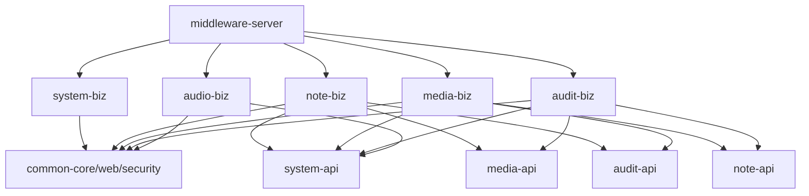

- 参考目录树：
```text
middleware
├─ pom.xml
│  # 聚合工程：统一 groupId、版本、Java 版本、模块列表
│
├─ middleware-dependencies
│  └─ pom.xml
│     # 可选 BOM：统一 Spring、MyBatis、Redis、AI SDK 等第三方版本
│
├─ middleware-common
│  ├─ pom.xml
│  │
│  ├─ middleware-common-core
│  │  └─ src/main/java/com/jacolp/middleware/common/core
│  │     ├─ result/
│  │     │  ├─ Result.java
│  │     │  └─ PageResult.java
│  │     ├─ exception/
│  │     │  ├─ BaseException.java
│  │     │  └─ ErrorCode.java
│  │     ├─ util/
│  │     └─ json/
│  │
│  ├─ middleware-common-web
│  │  └─ src/main/java/com/jacolp/middleware/common/web
│  │     ├─ handler/                       # 全局异常处理
│  │     ├─ config/
│  │     └─ filter/
│  │
│  └─ middleware-common-security
│     └─ src/main/java/com/jacolp/middleware/common/security
│        ├─ context/                       # CurrentUser、权限上下文
│        ├─ jwt/
│        ├─ annotation/
│        └─ interceptor/
│
├─ middleware-framework
│  ├─ pom.xml
│  │
│  ├─ middleware-oss-autoconfigure
│  │  └─ src/main/java/com/jacolp/middleware/framework/oss
│  │     ├─ config/
│  │     ├─ client/
│  │     └─ properties/
│  │
│  ├─ middleware-oss-starter
│  │  └─ pom.xml
│  │
│  ├─ middleware-markdown-autoconfigure
│  ├─ middleware-markdown-starter
│  │
│  └─ middleware-ai-starter
│     └─ src/main/java/com/jacolp/middleware/framework/ai
│        ├─ model/                         # ChatModel、EmbeddingModel 抽象
│        ├─ provider/                      # OpenAI / DeepSeek / Ollama 等适配
│        ├─ vector/
│        └─ config/
│
├─ middleware-module-system
│  ├─ pom.xml
│  │
│  ├─ middleware-module-system-api
│  │  └─ src/main/java/com/jacolp/middleware/module/system/api
│  │     ├─ UserProfileApi.java
│  │     ├─ UserQuotaApi.java
│  │     ├─ UserPermissionApi.java
│  │     ├─ dto/
│  │     │  ├─ UserBriefInfo.java
│  │     │  ├─ UserQuotaInfo.java           # 给音频、Agent、笔记等模块使用
│  │     │  ├─ ConsumeQuotaCommand.java
│  │     │  └─ ConsumeQuotaResult.java
│  │     ├─ enums/
│  │     │  └─ QuotaType.java
│  │     ├─ event/
│  │     └─ errorcode/
│  │
│  └─ middleware-module-system-biz
│     └─ src/main/java/com/jacolp/middleware/module/system
│        ├─ controller/
│        │  ├─ admin/
│        │  ├─ user/
│        │  └─ vo/                          # HTTP ReqVO / RespVO
│        ├─ application/
│        │  ├─ UserQuotaApiImpl.java        # 实现 system-api
│        │  └─ UserProfileApiImpl.java
│        ├─ service/
│        ├─ dal/
│        │  ├─ dataobject/
│        │  │  ├─ UserDO.java                # 不允许跨模块使用
│        │  │  ├─ RoleDO.java
│        │  │  └─ UserQuotaDO.java
│        │  └─ mapper/
│        └─ config/
│
├─ middleware-module-note
│  ├─ pom.xml
│  │
│  ├─ middleware-module-note-api
│  │  └─ src/main/java/com/jacolp/middleware/module/note/api
│  │     ├─ NoteApi.java
│  │     ├─ NoteSearchApi.java
│  │     ├─ dto/
│  │     │  ├─ NoteBriefInfo.java
│  │     │  ├─ NoteContentInfo.java
│  │     │  └─ NoteSearchQuery.java
│  │     └─ event/
│  │
│  └─ middleware-module-note-biz
│     └─ src/main/java/com/jacolp/middleware/module/note
│        ├─ controller/
│        │  ├─ admin/
│        │  ├─ user/
│        │  ├─ guest/
│        │  └─ vo/
│        ├─ application/
│        │  └─ NoteApiImpl.java
│        ├─ service/
│        ├─ dal/
│        │  ├─ dataobject/
│        │  │  ├─ NoteDO.java
│        │  │  ├─ TopicDO.java
│        │  │  ├─ TagDO.java
│        │  │  └─ NoteRelationDO.java
│        │  └─ mapper/
│        └─ domain/
│
├─ middleware-module-media
│  ├─ pom.xml
│  │
│  ├─ middleware-module-media-api
│  │  └─ src/main/java/com/jacolp/middleware/module/media/api
│  │     ├─ MediaFileApi.java
│  │     └─ dto/
│  │        ├─ MediaFileInfo.java
│  │        └─ MediaDeleteCommand.java
│  │
│  └─ middleware-module-media-biz
│     └─ src/main/java/com/jacolp/middleware/module/media
│        ├─ controller/
│        ├─ application/
│        ├─ dal/
│        │  ├─ dataobject/
│        │  │  └─ MediaFileDO.java
│        │  └─ mapper/
│        └─ infrastructure/
│           └─ oss/                         # 调用 framework 的 OSS 能力
│
├─ middleware-module-audio
│  ├─ pom.xml
│  │
│  ├─ middleware-module-audio-api
│  │  └─ src/main/java/com/jacolp/middleware/module/audio/api
│  │     ├─ AudioTaskApi.java
│  │     ├─ dto/
│  │     │  ├─ AudioTaskSubmitCommand.java
│  │     │  ├─ AudioTaskInfo.java
│  │     │  └─ AudioTaskPageQuery.java
│  │     ├─ enums/
│  │     │  └─ AudioTaskStatus.java
│  │     └─ event/
│  │        └─ AudioTaskCompletedEvent.java
│  │
│  └─ middleware-module-audio-biz
│     └─ src/main/java/com/jacolp/middleware/module/audio
│        ├─ controller/
│        │  ├─ user/
│        │  ├─ admin/
│        │  ├─ callback/                    # Python Worker 的回调接口
│        │  └─ vo/                          # AudioTaskSubmitReqVO 等
│        ├─ application/
│        │  └─ AudioTaskApiImpl.java
│        ├─ dal/
│        │  ├─ dataobject/
│        │  │  └─ AudioTaskDO.java
│        │  └─ mapper/
│        ├─ infrastructure/
│        │  ├─ stream/                      # Redis Stream 发布
│        │  └─ callback/
│        ├─ job/
│        │  └─ AudioTaskRetryJob.java
│        └─ config/
│
├─ middleware-module-agent
│  ├─ pom.xml
│  │
│  ├─ middleware-module-agent-api           # 暂时可不建；有外部模块调用再建
│  │  └─ src/main/java/com/jacolp/middleware/module/agent/api
│  │     ├─ AgentRunApi.java
│  │     └─ dto/
│  │        ├─ AgentRunCommand.java
│  │        └─ AgentRunInfo.java
│  │
│  └─ middleware-module-agent-biz
│     └─ src/main/java/com/jacolp/middleware/module/agent
│        ├─ controller/
│        │  └─ vo/
│        ├─ application/
│        │  └─ AgentRunApiImpl.java
│        ├─ domain/
│        │  ├─ agent/
│        │  ├─ tool/
│        │  └─ workflow/
│        ├─ tool/
│        │  ├─ NoteSearchTool.java          # 依赖 note-api
│        │  └─ AudioGenerateTool.java       # 依赖 audio-api
│        ├─ dal/
│        │  ├─ dataobject/
│        │  │  ├─ AgentDO.java
│        │  │  ├─ AgentRunDO.java
│        │  │  └─ AgentMessageDO.java
│        │  └─ mapper/
│        └─ infrastructure/
│           └─ ai/                          # 调用 framework-ai-starter
│
├─ middleware-module-audit                  # 审核逐渐复杂后再拆，不必第一天创建
│  ├─ middleware-module-audit-api
│  └─ middleware-module-audit-biz
│
├─ middleware-module-notification           # 邮件、站内信、推送逐渐复杂后再拆
│  ├─ middleware-module-notification-api
│  └─ middleware-module-notification-biz
│
└─ middleware-server
   ├─ pom.xml
   │  # 只依赖所有需要启用的 xxx-biz，不写 Controller/Service/Mapper
   │
   └─ src/main
      ├─ java/com/jacolp/middleware
      │  └─ MiddlewareServerApplication.java
      └─ resources
         ├─ application.yml
         ├─ application-dev.yml
         └─ logback-spring.xml
```

---

## 一、重构执行基线

### 1.1 当前工作状态

- 重构分支：`refactor-20260719`。
- 本文档是本轮重构的上下文恢复入口。后续如果发生对话上下文压缩，应先重新阅读本文档，再继续执行。
- 截至规划阶段，尚未修改项目代码。
- 当前项目约有 291 个生产 Java 文件、17 个 MyBatis Mapper XML，业务代码主要集中在 `middleware-server`。
- 当前自动化测试非常少，结构迁移前必须先建立最小行为基线，避免“编译成功但业务行为改变”。

### 1.2 本轮重构目标

本轮首先完成“模块化单体 + 限界上下文拆分 + API/Biz 依赖隔离”，然后在模块边界稳定后，对确有复杂业务规则的模块逐步实施战术 DDD。

本轮不是简单移动目录，也不要求一次性把所有业务对象改造成富领域模型。优先级如下：

1. 建立稳定的 Maven 模块边界。
2. 消除跨模块直接引用 Mapper、DO、内部 Service 的情况。
3. 保持现有 HTTP、数据库、登录和配置行为兼容。
4. 通过 `xxx-api` 建立跨模块契约。
5. 最后再提炼聚合、领域服务、仓储端口和状态机。

### 1.3 明确不在本轮首批范围内的内容

- 不在首批迁移中接入 Spring Security。
- 不改变现有 JWT 签发、Redis Token 校验、退出登录及账号激活流程。
- 不改变 `BaseContext`、`PermissionContext` 当前对外语义。
- 不修改数据库表名、字段、索引或已有数据。
- 不修改现有 HTTP 路径、请求方式和响应结构。
- 不创建尚无业务实现的 Agent 模块和 AI starter。
- 本轮暂不创建 `middleware-module-notification`；邮件能力先留在 system 模块内部。
- 不为了满足目录形式创建没有真实用途的空 API、空 Domain 或空 Repository。

## 二、规划校准与关键决策

### 2.1 Audit 本轮拆分

参考目录树中将 Audit 标记为“逐渐复杂后再拆”，但当前代码已经包含：

- `AuditController`、`AuditFacade`、`AuditService`；
- 笔记、图片、元数据三套审核记录；
- 三套审核 Mapper 和 XML；
- 笔记、标签、图片提交/撤销审核；
- 管理端批量审核和跨业务状态回写。

因此 `middleware-module-audit-api` 和 `middleware-module-audit-biz` 纳入本轮。拆分时通过 API 解除循环依赖：

- note-biz、media-biz 只依赖 audit-api，用于提交、撤销和检查待审核记录；
- audit-biz 只依赖 note-api、media-api，用于回写业务对象审核结果；
- 禁止 audit-biz 直接访问 NoteMapper、ImageMapper、TagMapper 等其他模块持久层。

### 2.2 Notification 本轮不拆

当前邮件能力主要服务于：

- 用户注册激活；
- 邮箱换绑验证码；
- 管理员自定义邮件。

当前尚无独立通知模型、站内信、模板中心或多渠道投递，因此暂放到：

```text
middleware-module-system-biz
└─ infrastructure/mail/
```

后续出现多业务模块发送通知、站内信、推送、统一模板和投递状态后，再建立 notification-api/biz。

### 2.3 Media 模块命名策略

- Maven 模块统一命名为 `middleware-module-media`，为未来文件类型扩展预留边界。
- 当前 HTTP 接口 `/user/image/**`、`/admin/image/**` 保持不变。
- 当前数据库表 `biz_image` 保持不变。
- 内部持久化对象可以先使用 `ImageDO`，不强制在第一阶段改成泛化的 `MediaFileDO`。
- 对其他模块暴露的契约使用 `MediaFileApi` 或语义明确的查询/命令 DTO，不暴露 `ImageDO`。

### 2.4 DDD 实施深度

第一轮按模块迁移现有代码时，允许保留 `service`、`dal` 形式，重点是先解除模块耦合。模块稳定后，再重点提炼以下领域规则：

| 模块 | 后续优先提炼的领域能力 |
| --- | --- |
| note | 笔记状态转换、发布规则、关联完整性、双链与资源解析 |
| audit | 审核任务、审核状态机、审核结果应用 |
| audio | 音频任务生命周期、重试与终态约束 |
| system | 用户额度、存储使用量和角色层级策略 |

领域层最终不得依赖 Spring MVC、MyBatis Mapper、HTTP VO 或具体基础设施客户端。

## 三、本轮实际模块范围

| 目标模块 | 主要职责 | 当前主要来源 |
| --- | --- | --- |
| `middleware-dependencies` | 第三方和内部模块版本管理 | 根 `pom.xml` 的 properties/dependencyManagement |
| `middleware-common-core` | Result、基础异常、JSON、无业务含义的通用工具 | `middleware-common` |
| `middleware-common-web` | 全局异常、Web/OpenAPI 配置、Web 通用能力 | server 的 handler/config 和部分 aspect |
| `middleware-common-security` | 现有 JWT、拦截器、登录上下文、认证基础设施 | common 的 context/JWT + server 的 interceptor |
| `middleware-oss-autoconfigure/starter` | OSS 自动装配与 starter | 现有 aliyun-oss 两模块 |
| `middleware-markdown-autoconfigure/starter` | Markdown 自动装配与 starter | 现有 flexmark 两模块 |
| `middleware-module-system-api/biz` | 用户、角色、登录、额度、系统初始化、监控、邮件 | User/Role/ApiDailyUsage 相关代码 |
| `middleware-module-note-api/biz` | 笔记、主题、标签、关系、转换、Diff、上下文 | Note/Topic/Tag 相关代码 |
| `middleware-module-media-api/biz` | 图片文件、OSS 调用、删除死信 | Image 相关代码 |
| `middleware-module-audio-api/biz` | 音频任务、回调、Redis Stream、重试 | AudioTask 相关代码 |
| `middleware-module-audit-api/biz` | 审核记录、管理端审核、审核编排 | Audit 相关代码 |
| `middleware-server` | 应用启动与运行配置 | 启动类、application、logback |

## 四、模块依赖规则

### 4.1 目标依赖图



### 4.2 强制约束

- `xxx-api` 只能包含跨模块契约、DTO、枚举、事件和错误码。
- `xxx-api` 不得依赖对应 `xxx-biz`。
- 业务模块不得依赖其他模块的 `xxx-biz`。
- 业务模块不得引用其他模块的 DO、Mapper、Controller VO 或内部 Service。
- DO 和 Mapper 只能在所属 biz 模块内部使用。
- Controller 只能调用本模块 application/service，不直接调用 Mapper。
- `middleware-server` 不得新增 Controller、Service、Mapper、Facade 或业务定时任务。
- 跨模块接口按实际调用需求提取，不创建通用 CRUD API。
- API DTO 应使用业务语义命名，例如 `ConsumeQuotaCommand`、`MediaFileInfo`，不能直接复用数据库 DO。

### 4.3 预期的跨模块契约

以下只是当前已识别的最小契约方向，实施时以真实调用为准：

#### system-api

- `UserProfileApi`：按用户 ID 获取必要的用户摘要。
- `UserQuotaApi`：查询、校验和消费额度/存储配额。
- `UserPermissionApi`：提供必要的角色或权限判断，不暴露 UserDO/RoleDO。

#### note-api

- 提供主题有效性检查，供 media 使用。
- 提供审核结果批量应用能力，供 audit 使用。
- 提供笔记摘要/搜索等真正需要跨模块使用的查询。
- 不提供 NoteMapper 式的通用数据库 CRUD。

#### media-api

- 提供媒体文件摘要和按 ID/批量查询能力，供 note 使用。
- 提供审核结果批量应用能力，供 audit 使用。
- 不向外暴露 OSS 客户端、ImageMapper 或 ImageDO。

#### audit-api

- 检查目标是否存在待审核申请。
- 创建审核申请。
- 撤销审核申请。
- 对外 DTO 不使用审核记录 DO。

#### audio-api

- 仅在确认有其他模块调用音频任务时创建和扩展。
- 当前 Controller 内部调用不构成必须创建 API 的理由。

## 五、登录、上下文与 Spring Security 策略

### 5.1 本轮保持不变的认证行为

- 管理端仍由 `JwtTokenAdminInterceptor` 处理。
- 用户端仍由 `JwtTokenUserInterceptor` 处理。
- 激活链接仍由 `JwtTokenActiveInterceptor` 处理。
- JWT 仍使用当前 secret、claim 和 TTL 配置。
- 登录后仍将 Token 保存到 Redis，并按当前 key 规则校验。
- 退出登录仍删除 Redis 中对应 Token。
- 当前用户 ID 仍通过 `BaseContext` 读取。
- 当前请求是否为管理端仍通过 `PermissionContext` 判断。
- 拦截器完成后仍必须清理 ThreadLocal。

### 5.2 本轮只建立替换边界

现有安全代码迁入 `middleware-common-security`，业务模块只允许依赖：

```text
com.jacolp.middleware.common.security.context
```

业务模块不得直接依赖：

- JWT 解析实现；
- Redis Token key；
- MVC HandlerInterceptor；
- Token 响应写入逻辑；
- 具体密码编码实现。

本轮不引入 `SecurityFilterChain`、`UserDetailsService`、`AuthenticationProvider` 或方法级授权。

### 5.3 后续替换方案

模块边界稳定后再单独实施 Spring Security：

1. 用 Security Filter 替换三个 MVC JWT 拦截器。
2. 将认证结果写入 `SecurityContextHolder`。
3. 让 `BaseContext` 先作为兼容适配器，从 `SecurityContextHolder` 读取用户 ID。
4. 将 `PermissionContext.isAdmin()` 映射到 GrantedAuthority。
5. 业务代码稳定后，再逐步替换静态上下文调用。
6. 登录签发和 Redis 单点 Token 策略是否保留，应作为独立安全设计决定。

这样未来替换时主要修改 common-security 和 system 的认证实现，不需要再次横向修改所有业务模块。

## 六、现有代码到目标模块的迁移映射

### 6.1 Common

#### common-core

- `Result`、`PageResult`。
- `BaseException` 和真正通用的异常基类。
- `JacksonObjectMapper` 和通用 JSON 支持。
- 不包含 Note、Image、Audio、Audit、User 等业务常量或枚举。

#### common-web

- `GlobalExceptionHandler`。
- 通用 ObjectMapper Web 配置。
- OpenAPI 通用配置和新的模块包扫描规则。
- 可复用的 Web 限流基础设施；若能力仍依赖当前用户，应单向依赖 common-security。

#### common-security

- `BaseContext`、`PermissionContext`。
- `JwtUtil`、`JwtProperties` 及 JWT 相关 key/claim 支持。
- 三个现有 JWT 拦截器及其 MVC 注册配置。
- 认证失败响应兼容逻辑。
- 与角色业务强相关的实现不下沉到 common；例如用户/角色查询仍属于 system-biz。

### 6.2 System

- User、Role、ApiDailyUsage 的 DO、Mapper 和 XML。
- 管理端和用户端 UserController。
- `UserUserService`、`AdminUserService` 及实现。
- `DataInitializer`、`PasswordEncoder`。
- `SuperiorRoleAspect`、`RoleValidationAspect` 及相关注解。
- `StorageHandlerAspect` 和额度策略归 system；它对 note/media 的使用量访问必须改为 API，不得直接引用 Mapper。
- `SystemMonitorService`、QPS 监控和 Monitor WebSocket 暂归 system。
- 邮件发送实现和模板暂归 `system-biz/infrastructure/mail`。

### 6.3 Note

- Note、Topic、Tag、NoteConverted、NoteContext、NoteChangeDiff。
- NoteTagMapping、NoteImageMapping、NoteEachMapping。
- 相关 Controller、Facade、Service、Mapper 和 XML。
- `NoteFacadeImpl`、`NoteRelationFacadeImpl` 作为 application 编排入口逐步拆解。
- `NoteBidirectionalLinkResolvePlugin` 放入 note 的 Markdown 基础设施适配层。
- `GuestCacheAspect`、`CheckMissingInfoAspect`、`NoteSizeLimitAspect` 及相关注解。
- Note 相关 CacheOperator/JsonOperator 根据实际用途放在 note infrastructure，避免进入 common-core。

### 6.4 Media

- Image、ImageDeleteDeadLetter 的 DO、Mapper 和 XML。
- 用户端/管理端 ImageController。
- ImageService 及实现。
- `ImageLimitAspect` 和相关注解。
- `ImageDeleteTask`。
- 对 OSS 的调用放到 `infrastructure/oss`，只依赖 framework OSS starter。
- 对 Topic 的校验改为调用 note-api。

### 6.5 Audio

- AudioTask 的 DO、Mapper 和 XML。
- 用户端/管理端 AudioController、公共回调 Controller。
- AudioTaskService、Redis Stream 发布和重试任务。
- 对 UserMapper、ApiDailyUsageMapper 的直接访问改为 system-api。
- 回调 Token 的现有安全逻辑和配置键保持不变。

### 6.6 Audit

- NoteAuditRecord、ImageAuditRecord、MetaAuditRecord。
- 三套 Mapper 和 XML。
- AuditController、AuditFacade、AuditService。
- 提交/撤销/查询审核记录属于 audit。
- 审核通过/拒绝后更新 Note、Tag、Image 状态时，必须调用 note-api/media-api。

### 6.7 Server

最终只保留：

- `MiddlewareServerApplication`；
- `application.yaml` 及环境配置；
- `logback-spring.xml`；
- 作为运行装配模块对各 `xxx-biz` 的依赖。

当前 server 下的 Mapper XML、邮件模板、Controller、Service、Facade、Aspect、Task 必须迁入对应模块。

## 七、分阶段执行计划

每个阶段都应形成独立、可审查的提交。每个阶段结束必须能够构建；不能把所有包移动完成后再统一修复。

### 阶段 0：建立基线与保护网

目标：在任何结构变更之前明确当前系统的可用状态。

实施内容：

1. 检查根 POM 当前 Java 21 与 `maven-compiler-plugin` 中 `source/target=6` 的冲突。
2. 将构建配置修复作为独立提交，不与模块迁移混合。
3. 执行 Maven 全量构建，记录当前可通过和不可通过项。
4. 记录当前 Controller 路由、MyBatis Mapper namespace、配置键和数据库表。
5. 为下列现有认证行为补充最小特征测试：
   - 无 Token 返回 401；
   - JWT 无效返回 401；
   - Redis Token 缺失或不一致返回 401；
   - 有效 Token 设置正确 userId/admin 标识；
   - `afterCompletion` 清理 ThreadLocal；
   - 登录、注册、激活等排除路径保持不变。
6. 对关键公开接口建立最小 MockMvc 或接口契约快照。

验收条件：

- 已知构建问题有明确记录或已单独修复。
- Git 工作区除本阶段预期改动外干净。
- 登录和上下文行为有最小保护测试。
- 数据库和 HTTP 契约没有改变。

### 阶段 1：Maven 聚合骨架与依赖管理

目标：先创建模块容器和依赖规则，不移动大量业务代码。

实施内容：

1. 创建 `middleware-dependencies` BOM。
2. 根 POM 只承担聚合、公共 properties、pluginManagement 和 BOM 导入。
3. 移除根 POM 中会传播到所有子模块的普通 dependencies。
4. 创建 common、framework、system、note、media、audit、audio 的聚合 POM。
5. 统一 groupId、version、Java 21、源码编码和插件版本。
6. library、autoconfigure、starter 模块不执行可执行 JAR repackage。
7. 内部模块版本统一在 BOM 管理，子模块依赖不重复写版本。

验收条件：

- Maven reactor 能识别完整模块树。
- 空骨架或最小模块可以完成 validate/package。
- 没有循环 Maven 依赖。
- 根 POM 不再向所有模块强制引入 Spring、JWT 等实现依赖。

### 阶段 2：迁移 Framework

目标：先迁移相对独立的 OSS 和 Markdown starter。

实施内容：

1. 将现有 aliyun-oss 两模块迁入 `middleware-framework`。
2. 将现有 flexmark 两模块迁入 `middleware-framework`。
3. 包名逐步统一到 `com.jacolp.middleware.framework.*`。
4. 更新 `AutoConfiguration.imports` 中的类名。
5. 检查配置 properties、条件装配和 starter 传递依赖。
6. 保持现有配置键和业务调用行为兼容。
7. 暂不创建 `middleware-ai-starter`。

验收条件：

- OSS 和 Markdown 自动装配测试通过。
- server 可通过 starter 使用现有能力。
- 不依赖组件扫描偶然发现自动配置类。

### 阶段 3：拆分 Common 与迁移现有安全实现

目标：建立所有业务模块依赖的公共基础。

实施内容：

1. 创建 common-core、common-web、common-security。
2. 按第六节映射迁移 Result、异常、JSON、Web 配置和安全代码。
3. 将业务常量、业务枚举从 common 移回对应业务模块/API。
4. 保持 JWT、Redis Token、拦截器、ThreadLocal 行为不变。
5. 更新 OpenAPI 扫描包到新的模块包名。
6. 保持认证失败响应结构兼容。

验收条件：

- common-core 不依赖 Spring Boot Web、Redis、MyBatis。
- common-web 和 common-security 依赖方向明确且无循环。
- 认证特征测试全部通过。
- 业务代码中不存在对旧 common 包的残留引用。

### 阶段 4：提取最小跨模块 API

目标：在移动业务实现之前建立依赖倒置所需的契约。

实施内容：

1. 根据真实调用提取 system-api、note-api、media-api、audit-api。
2. 如果 audio 暂无跨模块调用，可先只保留 biz，不强制创建空 api。
3. 创建 API DTO、Command、Query 和 Result 类型。
4. API 中不得出现现有 Entity/DO、Mapper、Controller VO。
5. 必要时在旧 server 中建立临时兼容适配器，使每一步迁移后仍能运行。
6. 兼容适配器必须标记为过渡代码，并在对应 biz 迁移完成后删除。

验收条件：

- 各 API 模块可独立编译。
- API 不依赖 biz。
- API 契约覆盖当前真实跨模块调用，不包含臆测接口。

### 阶段 5：按限界上下文纵向迁移

推荐顺序：

```text
system → media → note → audit → audio
```

每个业务模块都按相同步骤执行：

1. 迁移 DO 和 Mapper 接口。
2. 迁移 Mapper XML，并同步修改 namespace、parameterType、resultType。
3. 迁移 Service/Application 实现。
4. 迁移 Controller 和 HTTP VO。
5. 迁移 Aspect、Task、配置和模块私有资源。
6. 将跨模块内部调用替换为 `xxx-api`。
7. 删除旧 server 中已迁移代码和临时适配器。
8. 编译、测试、检查路由和 Mapper 加载。
9. 独立提交后再迁移下一个模块。

#### 阶段 5.1：System

- 先迁移用户、角色、登录、初始化和额度持久化。
- 登录行为只换包和模块，不重写认证流程。
- 对存储用量的统计通过 note-api/media-api 获取，禁止直接访问对应 Mapper。
- 邮件实现和模板一起迁入 system-biz。
- 监控和 WebSocket 暂归 system，后续若形成独立 observability 再拆。

#### 阶段 5.2：Media

- 迁移 Image、删除死信、OSS 适配和相关 Controller。
- 保持 image 路由、表名、配置键不变。
- 主题有效性校验通过 note-api。
- 审核申请通过 audit-api。

#### 阶段 5.3：Note

- 迁移 Note、Topic、Tag、转换、Diff、上下文和三类关系映射。
- NoteFacade/NoteRelationFacade 先作为 application 编排保留，再逐步拆小。
- 对图片查询改为 media-api。
- 对审核申请改为 audit-api。
- Note 模块是本轮最大风险模块，必须拆成多个小提交或至少多个验证检查点。

#### 阶段 5.4：Audit

- 迁移三套审核记录、Mapper、Controller 和编排服务。
- 对审核目标的状态更新改为 note-api/media-api。
- 消除 audit 与 note/media 之间的直接 Service/Mapper 引用。

#### 阶段 5.5：Audio

- 迁移任务、回调、Redis Stream 和重试任务。
- 将 UserMapper/ApiDailyUsageMapper 访问替换为 system-api。
- 保持 Python Worker 回调协议、状态码和 Redis Stream key 不变。

### 阶段 6：收缩 middleware-server

目标：server 成为纯运行装配模块。

实施内容：

1. server 只依赖需要启用的各 `xxx-biz`。
2. 启动类包名调整为 `com.jacolp.middleware`，确保组件扫描覆盖所有业务模块。
3. Mapper XML 全部迁移到所属模块。
4. MyBatis 配置从：

   ```yaml
   classpath:mapper/*.xml
   ```

   调整为支持多个模块 JAR 的形式，例如：

   ```yaml
   classpath*:mapper/**/*.xml
   ```

5. 各模块 Mapper 资源建议按模块分目录，避免同名覆盖。
6. 邮件模板等模块私有资源随 biz JAR 打包。
7. 更新 OpenAPI packagesToScan。

验收条件：

- server 下不存在 Controller、Service、Mapper、Facade、Aspect、业务 Task。
- 所有模块 Bean、Mapper XML 和模板资源均能从依赖 JAR 中加载。
- 应用可正常启动。

### 阶段 7：模块内战术 DDD

目标：在边界稳定后改进内部模型，而不是只留下新的分层目录。

实施原则：

1. 从状态机和业务不变量最明显的能力开始。
2. Domain 对象不直接持有 Mapper、Spring Bean 或 HTTP DTO。
3. Repository 接口放在 domain/application 所需的抽象侧，实现放在 infrastructure/dal。
4. Controller 只负责协议转换；application 负责编排；domain 负责业务规则。
5. 一次只重构一个业务用例，确保接口契约和数据库行为不变。

优先顺序：

```text
Note 状态与发布规则
→ Audit 状态机
→ AudioTask 生命周期
→ UserQuota/StorageQuota 策略
```

## 八、资源与配置迁移细节

### 8.1 Mapper XML

- Mapper 接口和 XML 必须同模块迁移。
- 每次修改 Java 包名时同步更新 XML namespace。
- 检查 XML 中所有全限定 `parameterType`、`resultType` 和自定义 typeHandler。
- 推荐资源目录：`src/main/resources/mapper/{module}/`。
- server 使用 `classpath*:mapper/**/*.xml` 扫描所有依赖 JAR。

### 8.2 Spring 组件扫描

- 所有业务模块 Java 包统一位于 `com.jacolp.middleware` 之下。
- `MiddlewareServerApplication` 位于 `com.jacolp.middleware` 根包。
- framework autoconfigure 不依赖主应用组件扫描，必须通过 Spring Boot 自动装配清单加载。

### 8.3 配置兼容

首轮迁移保持以下配置前缀和外部环境变量兼容：

- `jacolp.jwt.*`
- `jacolp.redis.*` / `spring.data.redis.*`
- `jacolp.aliyun.oss.*` 和 `aliyun.oss.*`
- `jacolp.markdown.*`
- `jacolp.audio.*`
- `jacolp.image.*`
- `jacolp.mail.*` / `spring.mail.*`

如需重命名配置，应在独立后续阶段提供兼容映射，不能与模块迁移同时进行。

### 8.4 HTTP 与数据库兼容

- `/admin/**`、`/user/**`、`/guest/**`、`/common/**` 路由保持不变。
- Result/PageResult JSON 结构保持不变。
- 所有表名和字段名保持不变。
- Entity 改名为 DO 只改变 Java 类型，不改变 SQL。
- 前端不参与本轮结构迁移。

## 九、测试与架构守卫

### 9.1 每阶段必做验证

1. Maven 全量编译和测试。
2. 对本阶段模块单独执行测试。
3. 检查 `git diff`，确认没有意外修改其他模块。
4. 检查所有旧包名是否仍被引用。
5. 检查 Mapper XML namespace 和扫描结果。
6. 检查 Spring Bean 是否存在重复定义或无法注入。
7. 检查现有 HTTP 路由未丢失或重复。

### 9.2 建议增加的架构测试

可使用 ArchUnit 或等效测试落实以下规则：

- `..module.<name>.api..` 不得依赖 `..module.<name>.dal..` 或 `..biz..`。
- 一个业务模块不得依赖另一个业务模块的 `controller/service/dal`。
- Controller 不得依赖 Mapper。
- DO 不得出现在其他模块包中。
- domain 不得依赖 Spring MVC 和 MyBatis。
- server 不得包含 Controller、Service 和 Mapper。

Maven 模块本身已经能阻止部分越界依赖，ArchUnit 用于补充模块内部的包级约束。

### 9.3 重点回归场景

- 用户/管理员登录、退出和 Token 失效。
- 用户激活和邮箱换绑。
- 笔记上传、修改、Diff、关联解析、发布和访客访问。
- 标签、主题、图片和笔记审核。
- 图片上传、替换、删除和 OSS 死信重试。
- 音频任务提交、回调、查询和超时重试。
- 存储配额与 API 每日使用量。

## 十、提交、回退与执行纪律

- 一个提交只处理一个明确阶段或一个业务模块。
- Maven 骨架、包移动、行为重构不要混在同一个提交。
- 优先使用可追踪的文件移动，便于 Git 识别历史。
- 每次提交前必须完成对应验收条件。
- 发现旧逻辑缺陷时先记录；除非阻止迁移，否则不要顺手修改行为。
- 必须修复的旧缺陷应单独提交，并写明它不是结构迁移。
- 不使用破坏性 Git 命令覆盖已有工作。
- 任何阶段失败时，优先回退当前小阶段，不回退已经验证完成的前置阶段。

建议提交序列：

```text
build: establish Java 21 build baseline
build: add dependency BOM and module aggregators
refactor: move OSS and Markdown framework modules
refactor: split common core web and security
refactor: introduce inter-module API contracts
refactor: migrate system module
refactor: migrate media module
refactor: migrate note module
refactor: migrate audit module
refactor: migrate audio module
refactor: reduce server to runtime assembly
test: enforce module architecture boundaries
```

## 十一、整体验收标准

完成本轮结构重构时，必须同时满足：

- Maven 全量构建与测试通过。
- 原有 HTTP 路径、方法、主要请求响应结构不变。
- 数据库表结构和现有数据不变。
- JWT、Redis Token、账号激活和上下文行为不变。
- 所有 Mapper XML 能从各业务模块 JAR 正确加载。
- 不存在跨模块 DO、Mapper 或 biz-to-biz 直接依赖。
- `middleware-server` 只包含启动和运行配置。
- common-core 不包含业务常量和具体基础设施依赖。
- framework starter 能通过自动装配正常工作。
- 前端无需因本轮结构重构修改接口调用。
- 结构不是只有空目录：复杂模块已有明确 application/domain/infrastructure 演进路径。

## 十二、上下文恢复摘要

如果后续发生对话上下文压缩，按以下顺序恢复：

1. 阅读本文档第一至五节，恢复目标、范围和安全策略。
2. 查看第七节，确认当前执行到哪个阶段。
3. 查看 Git 分支、最近提交和工作区状态。
4. 重新运行当前阶段的验收命令，不重复已经完成的迁移。
5. 继续遵循“登录语义不变、跨模块只通过 API、每阶段可构建”的原则。

当前默认的下一步是：

```text
阶段 0：建立构建与行为基线
```

在阶段 0 完成并验证前，不开始批量移动业务包。

## 十三、执行记录

### 2026-07-19：阶段 0 启动

- 已确认项目统一使用 JDK 21。
- JDK 21 下现有生产代码可以完成全量编译。
- 已识别原有唯一 Flexmark 测试因错误使用无启动类的 `@SpringBootTest` 而失败。
- 迁移前 HTTP、Mapper、数据库表、跨模块 SQL 和配置键基线记录在 [重构基线-20260719.md](./重构基线-20260719.md)。
- 已将 Maven 编译版本和运行时守卫统一为 JDK 21，并显式配置 Lombok annotation processor。
- 已将 Flexmark 空上下文测试改为自动装配测试。
- 已补充三个 JWT 拦截器及 WebMVC 认证路径特征测试，共 10 个 server 测试。
- JDK 21 下 `mvn clean verify` 已通过，8 个 Reactor 模块全部构建成功。
- 阶段 0 已完成，下一步进入阶段 1：Maven 聚合骨架与依赖管理。

### 2026-07-19：阶段 1 完成

- 已创建独立 `middleware-dependencies` BOM，并由根 POM 导入。
- 已创建 common、framework、system、note、media、audit、audio 聚合模块及目标 API/Biz 子模块。
- 当前 Maven Reactor 从 8 个项目扩展为 32 个项目，依赖图无循环。
- 原 `middleware-common` 已机械迁移为 `middleware-common-legacy`，server 和 pojo 暂时依赖该迁移壳。
- 根 POM 不再向所有子模块传播普通 dependencies。
- Spring Boot Maven Plugin 已移入 pluginManagement，只有 `middleware-server` 执行可执行 JAR repackage。
- 旧模块的显式第三方版本已转入 BOM；JDK、Lombok、MySQL 等既有版本保持不变。
- JDK 21 下 32 模块 `mvn clean verify` 已通过，阶段 1 完成。
- 下一步进入阶段 2：将 OSS 和 Markdown 实现迁入 `middleware-framework`。
